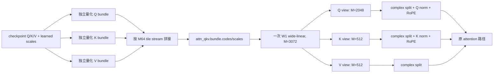

# Fairy2i W1 bundle_v1 QKV 合并与 Metal 验证报告

日期：2026-07-17

分支：`codex/metal`

实现基线：`543ccabb`（`fairy2i: add W2 bundle Metal support`）

## 1. 结论

Qwen3-8B Fairy2i W1 的 Q、K、V 应在转换时合并为一个 `attn_qkv` bundle。采用的最终方案不是重新
量化或逐元素交织，而是先分别完成 Q/K/V 的原有 `bundle_v1` 量化，再按完整 M64 tile stream 顺序拼接：

```text
[Q 的全部 M64×K64 tiles][K 的全部 tiles][V 的全部 tiles]
```

运行时加载一对合并后的 `codes/scales` tensor，建立一次 3072-wide W1 linear，然后用三个零拷贝 view
恢复 Q、K、V。旧的、分别保存 Q/K/V 的 bundle GGUF 仍可加载，作为兼容路径。

在 Apple M4 上的最终匹配温度 ABBA 测试中：

| workload | 旧 separate Q/K/V | 新 merged QKV | 变化 |
| --- | ---: | ---: | ---: |
| pp512 | 169.6105 tok/s | 170.5745 tok/s | +0.5684% |
| tg128 | 22.6779 tok/s | 23.5734 tok/s | +3.9490% |

结果来自 `old -> new -> new -> old`、每段 R3，共计每种布局 6 个 pp512 和 6 个 tg128 样本。转换和全文件
验证刚结束时机器处于持续降频状态，因此表中的绝对值不应与此前冷机约 196 tok/s 的结果横向比较；ABBA
序列中的旧/新相对差异有效，且新布局的 6 个 tg128 样本全部高于旧布局的 6 个样本。

本方案不需要新增或修改 Metal kernel。现有 bundle W1 kernel 的 M 维本来就是任意 64 的倍数；把三段
合法的 M64 tile stream 连起来后，同一个 kernel 可以直接遍历合并后的 M=3072。改动集中在 converter、
GGUF tensor 映射、模型加载和 Fairy2i graph 的 QKV 建图。

## 2. QKV 尺寸和物理布局

本次 Qwen3-8B 的复数逻辑尺寸为：

| projection | 逻辑 M | 逻辑 K | M64×K64 physical tiles |
| --- | ---: | ---: | ---: |
| Q | 2048 | 2048 | 1024 |
| K | 512 | 2048 | 256 |
| V | 512 | 2048 | 256 |
| QKV merged | 3072 | 2048 | 1536 |

每个 projection 仍先独立调用
`quantize_linear_to_fairy2i_bundle_v1_w1_learned_scale()`。这保证 Q/K/V 各自的 learned scale、2-bit code
和原 bundle 结果完全不变。随后 `merge_fairy2i_bundle_v1_m()` 只沿 physical-tile 轴拼接：

```python
qkv_codes  = concatenate([q_codes,  k_codes,  v_codes],  axis=0)
qkv_scales = concatenate([q_scales, k_scales, v_scales], axis=0)
```

写入 GGUF 后每层只保留：

```text
blk.N.attn_qkv.bundle.codes   ne = [16, 2, 64, 1536]
blk.N.attn_qkv.bundle.scales  ne = [ 2, 2,     1536]
```

其中 branch order 仍为 `U0,W0`，单个 physical tile 内的
`[m16][q4][branch][row_lane]` 次序完全不变。合并只改变 tile stream 的外层 M 区间。

QKV 的量化数据量也不变：每层仍是 `1536 × 2056 = 3,158,016 B`。收益目标是减少重复 activation staging、
算子和 dispatch，而不是继续压缩权重。

旧布局每层 Q/K/V 使用 6 个 tensor（各自的 codes/scales），新布局使用 2 个 tensor。36 层共减少 144 个
tensor，整个文件从 651 个 tensor 降为 507 个。由于量化 payload 不变，GGUF 仅因 metadata/alignment 从
`3,368,144,832 B` 小幅降到 `3,368,133,696 B`。

若 checkpoint 带完整的 Q/K/V bias，新 converter 会把原来的：

```text
[Q.real,Q.imag], [K.real,K.imag], [V.real,V.imag]
```

重排为合并 linear 所需的：

```text
[Q.real,K.real,V.real,Q.imag,K.imag,V.imag]
```

partial QKV bias set 会被拒绝。该逻辑只作用于 `bundle_v1`；旧 `tile64_v2` 转换路径不变。本次 checkpoint
的 `attention_bias=false`。

## 3. 转换、加载和 attention graph



加载端新增 `blk.%d.attn_qkv` tensor name，并为 W1、Qwen3、bundle_v1 尝试创建一个逻辑形状
`K=2048, M=3072` 的 optional linear：

- 合并 tensor 完整存在时，拒绝混入 separate Q/K/V bundle 或 separate Q/K/V bias；
- 合并 tensor 不存在时，继续要求并加载旧的 Q、K、V 三个 linear；
- 由 tensor 是否存在自动选择路径，不新增 layout metadata，也不破坏已有 GGUF。

graph 中合并 linear 的输出 shape 为 `[3072, n_tokens]`。三个 view 的 M 区间为：

```text
Q: offset 0,          length 2048
K: offset 2048,       length  512
V: offset 2048 + 512, length  512
```

view 的 token stride 保持父 tensor 的 `qkv->nb[1]`。因此不复制输出，也不在加载时拆分或重排权重。view
之后的 complex split、Q/K RMSNorm、RoPE、KV cache 和 attention 算法均未修改。

## 4. Metal 如何利用合并布局

### 4.1 Prefill

旧路径对 Q、K、V 各调用一次 `GGML_OP_FAIRY2I_WIDE_LINEAR_W1`。每次调用都会执行一次
`kernel_fairy2i_act_half_64_stage_bf16`，把同一个 attention input staging 成 kernel 使用的 half tile，
随后分别 dispatch 64、16、16 个 M32 row groups。

新路径只 staging 一次，并一次 dispatch 96 个 M32 row groups：

```text
旧：stage(x) + Q(64 groups), stage(x) + K(16), stage(x) + V(16)
新：stage(x) + QKV(96 groups)
```

权重 tile 和 MMA 数量没有增加；减少的是两次相同 activation staging、两个 graph op、两个 pipeline
dispatch，以及相关的 concurrency reset/scheduler 开销。实际计算仍由现有
`kernel_fairy2i_bundle_w1_half_mma32x16_k16` 完成。

prefill 下三个输出 view 的 token stride 为完整 QKV row stride，所以它们不是 ggml contiguous tensor；每个
token 内的 Q/K/V rows 仍分别连续。现有 complex split、norm 和 RoPE kernel 已正确使用 stride。pp512 的
端到端净收益为 +0.57%，说明这部分 stride 成本没有抵消 staging/dispatch 收益。

### 4.2 Decode

decode 的 `act_rows=1`，原路径没有 activation staging。合并后的主要收益来自把三个 W1 graph op 和三个
Metal dispatch 降成一个。原来的 output tile 总数为 `256 + 64 + 64 = 384`，合并后仍为 384，所以 code、
scale 和 activation 的有效数学读取量不变。

实际 kernel 仍是现有无 bias function-constant 路径
`kernel_fairy2i_bundle_w1_bf16_tile8x1_w8_full_nobias_fc_simd`。一次较宽 dispatch 减少了 command encoding、
function-constant pipeline 调度和小 dispatch 的固定成本，最终 tg128 提升 3.95%。

### 4.3 Graph 路径证据

`GGML_METAL_GRAPH_DEBUG=2`、关闭 warmup 的同一 prompt+decode 运行中：

| 项目 | 旧 separate | 新 merged |
| --- | ---: | ---: |
| W1 wide-linear nodes | 504 | 360 |
| 每层每个 graph 的 attention QKV linear | 3 | 1 |
| 新 `QKVcur` shape | - | `[3072,N]` |
| Q/K/V 输出恢复 | 三个独立输出 | `[2048,N]`, `[512,N]`, `[512,N]` views |

日志包含两个 graph shape（prompt 和 decode），所以新布局共有 `2 × 36 = 72` 个 `QKVcur`，旧布局共有
`2 × 36 × 3 = 216` 个独立 Q/K/V 输出。全模型每层的 W1 linear 数从 7 降为 5，因此总数从
`2 × 36 × 7 = 504` 降为 `2 × 36 × 5 = 360`。

原始路径日志：

```text
tmp/fairy2i-w1-qkv-merge/old-graph-nowarm.log
tmp/fairy2i-w1-qkv-merge/qkv-graph-nowarm.log
```

## 5. 正确性验证

生成模型：

```text
/Users/a1806/llama/qwen_1bit_scale/qwen3-fairy2i-w1-bundle-v1-qkv.gguf
size   3368133696 bytes
SHA256 bd94c77c00c8ac51031f725aa585a5a7bcc74d917dfa8813c119491e0a384222
```

全文件 canonical validator 已扩展为把 `attn_qkv` 的物理 tile stream 依次与 V2 GGUF 的 `attn_q`、
`attn_k`、`attn_v` 比较。结果：

```text
Fairy2i bundle_v1 validation passed
branch_order=U0,W0
linear_count=180
common_tensor_count=147
tensor_count=507
v2_weight_bytes=1085276160
bundle_weight_bytes=871612416
canonical_sha256=def7a1e3c730e3b6e3e266d6e7df6697000b1060cdf712989652bd2b18c670e8
```

端到端固定 seed、`temp=0`、32-token generation 与旧 separate bundle 的 stdout 逐字节一致。其他检查：

| 检查 | 结果 |
| --- | --- |
| Python bundle pack/merge tests | 9/9 PASS |
| canonical validator 旧 separate bundle 回归 | PASS，252 个 linear |
| `test-fairy2i-loader` | PASS，含 merged QKV synthetic GGUF |
| `test-fairy2i` | PASS，Metal W1/W2 suite 全部通过 |
| Release Metal build | PASS |
| `git clang-format --diff` | clean |
| touched C++ `clang-tidy` | exit 0；仅仓库既有全局告警 |
| `git diff --check` | clean |

关键原始文件：

```text
tmp/fairy2i-w1-prefill-share/qkv-layout-validation.txt
tmp/fairy2i-w1-qkv-merge/old-layout-validation.txt
tmp/fairy2i-w1-qkv-merge/old-cli.txt
tmp/fairy2i-w1-qkv-merge/qkv-cli.txt
tmp/fairy2i-w1-qkv-merge/test-loader.log
tmp/fairy2i-w1-qkv-merge/test-ops.log
```

## 6. 性能复现

ABBA 四段均使用相同 Release Metal binary，`n_batch=2048`、`n_ubatch=512`、8 threads、Flash Attention、
所有层 offload 到 Metal。没有并发运行多个 `llama-bench`。

```bash
OLD=/Users/a1806/llama/qwen_1bit_scale/qwen3-fairy2i-w1-bundle-v1.gguf
NEW=/Users/a1806/llama/qwen_1bit_scale/qwen3-fairy2i-w1-bundle-v1-qkv.gguf

./build-rel-metal/bin/llama-bench -m "$OLD" -ngl 99 -fa 1 -t 8 -p 512 -n 128 -r 3 -o json
./build-rel-metal/bin/llama-bench -m "$NEW" -ngl 99 -fa 1 -t 8 -p 512 -n 128 -r 3 -o json
./build-rel-metal/bin/llama-bench -m "$NEW" -ngl 99 -fa 1 -t 8 -p 512 -n 128 -r 3 -o json
./build-rel-metal/bin/llama-bench -m "$OLD" -ngl 99 -fa 1 -t 8 -p 512 -n 128 -r 3 -o json
```

原始 JSON：

```text
tmp/fairy2i-w1-qkv-merge/abba-1-old-r3.json
tmp/fairy2i-w1-qkv-merge/abba-2-new-r3.json
tmp/fairy2i-w1-qkv-merge/abba-3-new-r3.json
tmp/fairy2i-w1-qkv-merge/abba-4-old-r3.json
```

## 7. 转换命令和保留脚本

```bash
PYTHONPATH=gguf-py .venv/bin/python gguf-py/convert_fairy2i_qwen3.py \
  /Users/a1806/llama/qwen_1bit_scale/checkpoint-5639 \
  /Users/a1806/llama/qwen_1bit_scale/qwen3-fairy2i-w1-bundle-v1-qkv.gguf \
  --weight-layout bundle_v1 --verbose
```

保留的生产代码和验证脚本：

- `gguf-py/convert_fairy2i_qwen3.py`
- `gguf-py/fairy2i/quant/tile64_v2.py`
- `gguf-py/validate_fairy2i_bundle_v1.py`
- `gguf-py/tests/fairy2i/test_tile64_v2.py`

模型权重位于仓库外，没有加入 Git。本轮只新生成一份最终 merged-QKV GGUF，没有保留额外转换候选。

## 8. 可继续尝试但本轮不实现的更激进方案

1. **QKV + split/norm/RoPE 融合**：让专用 kernel 直接写 Q/K/V 最终目标 buffer，并在写回时融合 Q/K
   head norm 和 RoPE，可消除 strided view 的下游读取；代价是把模型语义引入目前通用的 linear kernel。
2. **按 GQA head group 交织 Q/K/V tiles**：可让后续 attention 更早消费局部 head 数据，但会破坏当前连续
   M 线性语义和零拷贝 view，必须配套专用输出 scatter kernel。
3. **更大的 decode output tile**：同一 threadgroup 计算更多 QKV rows，使 activation K-block 在
   threadgroup 内复用；需要在寄存器压力、occupancy 和 reduction 成本之间重新 sweep。
4. **跨多个 attention projection 的 graph 级 activation cache**：理论上还能扩展到 O/MLP，但 buffer
   生命周期和 Metal concurrency/cache 行为更复杂。当前 QKV 物理合并已经以模型语义边界实现了最安全的
   局部共享，因此不保留此前显式 staging 实验代码。
