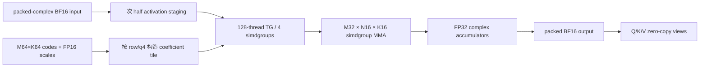
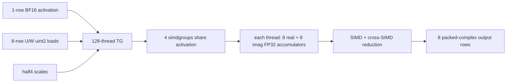

# Fairy2i W1 Metal 硬件压榨与 profiling 实验报告

日期：2026-07-18

分支：`codex/metal`

最终测量二进制提交：`86e7a27c`（build 7035，Release + Metal + Accelerate）

对应计划：`FAIRY2I_W1_METAL_HARDWARE_SATURATION_OPTIMIZATION_PLAN.md`

## 1. 最终结论

本轮没有找到一个满足保留门槛的新增性能 kernel。最终最快且最稳妥的 exact 路径仍是：

```text
GGUF bundle_v1 code_order = m16_q4_branch_lane
QKV outer layout          = [all Q M64 tiles][all K M64 tiles][all V M64 tiles]
prefill kernel            = M32 × N16 × K16, FP32 accumulate
decode kernel             = rows8, 128 threads, shared activation, FP32 accumulate
dense lm_head             = generic kernel_mul_mv_f16_f16_4
```

唯一新增并保留的运行时代码变化是删除 decode 从未读取的 Fairy2i activation/scratch 申请。它是内存和代码
简化，不宣称 tok/s 提升。所有失败的 tile、decode ownership、output-head selector、native BF16 和临时布局
选项都已从生产路径删除。

最终 reverse-BAAB R5 结果：

| workload | separate Q/K/V | merged QKV | merged 相对变化 | 判定 |
| --- | ---: | ---: | ---: | --- |
| pp512 | 200.787691 | 201.545221 | +0.377279% | 中性，低于 2% 门槛 |
| tg128 | 28.245978 | 28.696312 | +1.594328% | 小正收益，低于 2% 性能门槛 |

关键硬件结论比单个 tok/s 数字更重要：

- pp512 的 W1 MMA kernel 占 shader 时间 **95.5%**，F32 limiter **87.59%**、F32 utilization
  **75.01%**，GPU read 仅 **24.31 GB/s**；它是 F32/MMA 指令吞吐瓶颈，不是权重带宽、scale load 或
  地址计算瓶颈。
- tg trace 中 dense F16 `lm_head` 占 **93.4%**，W1 decode 只占 **5.8%**。`lm_head` 以约
  **100.54 GB/s** 读取权重；继续微调 W1 decode 的端到端收益上限很低。
- packed-complex split/merge、RMSNorm、RoPE、KV copy、attention 等每组均低于计划规定的 3% 实现门槛，
  因此没有为了理论融合留下新的 graph op 或维护分支。

## 2. 环境、模型和测量纪律

| 项目 | 值 |
| --- | --- |
| 机器 | Mac16,10，Apple M4，24 GiB，10 logical CPUs |
| 系统 | macOS 26.3（25D125） |
| 编译器 | Apple clang 21.0.0，arm64-apple-darwin25.3.0 |
| 构建 | `CMAKE_BUILD_TYPE=Release`，`GGML_METAL=ON`，`GGML_NATIVE=ON` |
| threads / batch / ubatch | 8 / 2048 / 512 |
| GPU / FA / mmap | `-ngl 99 -fa 1 --mmap 1` |
| 主要 workload | pp512、tg128，默认 `r=5` |
| 冷却 | 任意性能或正确性执行结束后，下一项至少等待 60 秒 |

模型：

| 名称 | 路径 | 文件大小 | SHA256 |
| --- | --- | ---: | --- |
| OLD | `/Users/a1806/llama/qwen_1bit_scale/qwen3-fairy2i-w1-bundle-v1.gguf` | 3,368,144,832 B | `9f46dc9a82384b8ada003c79f8be635446b4fee28e9a0c4b5ee30908b23f5de5` |
| QKV | `/Users/a1806/llama/qwen_1bit_scale/qwen3-fairy2i-w1-bundle-v1-qkv.gguf` | 3,368,133,696 B | `bd94c77c00c8ac51031f725aa585a5a7bcc74d917dfa8813c119491e0a384222` |

本轮绝对性能在不同时间段明显漂移，曾分别出现约 170 pp / 23 tg 和 201 pp / 29 tg 的稳定区间。
因此只在同一阶段、相邻运行和 ABBA/BAAB 内做相对判断，不跨时段拼出虚假的百分比。每个 JSON 都保留
五个原始样本。

统一门控脚本：

```text
perf/scripts/run_fairy2i_metal_bench.sh
/tmp/fairy2i-metal-bench-cooldown/last-end-epoch
```

脚本拒绝并发 benchmark，并在成功或失败后都记录结束时间。

## 3. 最终权重布局和 QKV 组织

### 3.1 M64×K64 bundle tile

每个 code byte 保存同一输出行连续四个 K 位置：

```text
byte = c[k+0] | c[k+1] << 2 | c[k+2] << 4 | c[k+3] << 6
```

tile 内地址分解：

```text
m16  = row_in_tile / 16
lane = row_in_tile % 16
q4   = k_in_tile / 4
slot = m16 * 16 + q4

codes[tile][slot][branch][lane]
branch = [U0, W0]
```

物理成本：

```text
codes  [m16=4][q4=16][branch=2][lane=16] = 2048 B
scales [branch=2][real/imag=2] FP16       =    8 B
total                                               2056 B/tile
```

scale 作用域为 M64×K64，顺序为 `[U.real,U.imag,W.real,W.imag]`；GGUF tensor 起始地址按 64 B 对齐。
文件直接 mmap/上传，loader 不生成第二份整模型 repack。

此前已经对完整 GGUF 测过 M16/M8 joint、M32×K16 native packet、bitplane、row-joint 和 inline scale。
最终 S0 `m16_q4_branch_lane` 在综合 pp/tg 上最好；最接近的 row-joint 只有 pp `+0.257%`，同时 tg
`-2.469%`，故不晋级。本轮 counter 又证明 code/scale 带宽不是主要 limiter，因此不再生成重复的大 GGUF。

### 3.2 merged QKV 只合并最外层 tile stream

Q/K/V 先独立按相同 quantizer 量化，再沿 physical M64 tile 轴拼接：

```text
qkv_codes  = concat(q_codes,  k_codes,  v_codes)
qkv_scales = concat(q_scales, k_scales, v_scales)
```

Qwen3-8B 的逻辑 shape：

| projection | M | K | M64×K64 tiles |
| --- | ---: | ---: | ---: |
| Q | 2048 | 2048 | 1024 |
| K | 512 | 2048 | 256 |
| V | 512 | 2048 | 256 |
| QKV | 3072 | 2048 | 1536 |

每层从六个 separate tensor 减为：

```text
blk.N.attn_qkv.bundle.codes  [16,2,64,1536]
blk.N.attn_qkv.bundle.scales [ 2,2,   1536]
```

36 层共少 144 个 tensor，507-tensor GGUF 比 separate 文件少 11,136 B。加载端自动识别 merged 或旧
separate 集合，拒绝 mixed/partial set；graph 对 `[3072,N]` 输出建立 Q `[0,2048)`、K `[2048,2560)`、
V `[2560,3072)` 的零拷贝 view，不拆权重、不复制输出。

## 4. Metal 如何消费最终布局

### 4.1 pp512 / prefill



- 一个 threadgroup 计算 M32×N16；128 threads 分成 4 个 simdgroup。
- 一个 thread 对应一个 `(row,q4)`，自然读取 U/W branch-plane 中的相邻 byte。
- 每个 byte 展开四个 K phase；K16 substep 送入 simdgroup matrix，累加保持 FP32。
- K=2048 时 128 个 K16 substep；K=6144 时 384 个。
- merged QKV 只 staging attention input 一次并 dispatch 96 个 M32 row groups；旧路径分别为 64/16/16。

M16×N32 的权重摊销更好，但寄存器/累加器压力使 pp 从约 201.7 降至 187.1；M8×N64 更降至
148.4。硬件 counter 说明当前 M32×N16 已在 M4 的 F32/MMA 与 occupancy 之间达到本实现的局部最佳。

### 4.2 tg128 / decode



- 一个 TG 负责 8 个 output rows；branch-plane 允许 U、W 各做自然对齐的连续 `uint2` load。
- 共享 activation 的代价是跨 SIMD reduction 和较多 accumulator，但避免每个 SIMD 重读整个 activation。
- “4 SIMD 各算 2 行”和“2 SIMD 各算 4 行”分别回退到 26.644、27.883 tg/s，证实 activation 重读成本
  大于减少 accumulator/reduction 的收益。
- decode 不使用 prefill activation stage。本轮让 `extra_act_q()` 在 `act_rows==1` 直接返回 0，并删除永远
  为零/未消费的 `extra_act_d`、`extra_partial` 接口；K2048/K6144 每 op 不再请求约 4 KiB/12 KiB 的无用
  activation scratch。

## 5. Native Metal profiling

### 5.1 pp trace

trace：

```text
/tmp/fairy2i-w1-metal-saturation/profile/profile-qkv-pp.20260717T124200Z.trace
/tmp/fairy2i-w1-metal-saturation/profile/profile-qkv-pp.shader-summary.txt
/tmp/fairy2i-w1-metal-saturation/profile/profile-qkv-pp.gpu-counter-summary.txt
```

| shader | share | total ms | sampled intervals |
| --- | ---: | ---: | ---: |
| W1 `half_mma32x16_k16` | 95.5% | 2861.097 | 2484 |
| `mul_fuse_1` | 2.1% | 63.221 | 213 |
| complex add | 0.8% | 24.510 | 425 |
| set_rows F16 | 0.3% | 9.631 | 206 |
| SiLU | 0.3% | 8.745 | 28 |
| complex merge | 0.3% | 7.709 | 82 |
| Flash Attention | 0.2% | 6.369 | 13 |
| complex split | 0.2% | 5.150 | 79 |
| dense output | 0.2% | 4.711 | 8 |
| RMSNorm / RoPE / copy | <0.1% each | — | — |

W1 counter：

| counter | mean |
| --- | ---: |
| kernel occupancy | 32.909% |
| instruction throughput limiter | 86.229% |
| ALU utilization | 54.403% |
| F32 limiter / utilization | 87.590% / 75.010% |
| integer+conditional limiter | 29.209% |
| L1 limiter | 11.585% |
| GPU read bandwidth | 24.308 GB/s |
| LLC limiter | 8.712% |

结论：pp 的直接优化对象是 complex MMA 数量或 FP32 accumulator 组织，而不是更多权重 byte-order、32-bit
offset、scale broadcast 或更大的 staging cache。唯一能直接减少主瓶颈算术量的 3-MMA/Gauss complex 公式
会改变浮点求和/舍入，本轮按约束不进入默认 exact 路径。

### 5.2 tg trace

trace：

```text
/tmp/fairy2i-w1-metal-saturation/profile/profile-qkv-tg4.20260717T125626Z.trace
/tmp/fairy2i-w1-metal-saturation/profile/profile-qkv-tg4.shader-summary.txt
/tmp/fairy2i-w1-metal-saturation/profile/profile-qkv-tg4.gpu-counter-summary.txt
```

| shader | share | total ms | intervals |
| --- | ---: | ---: | ---: |
| dense `kernel_mul_mv_f16_f16_4` | 93.4% | 34.769 | 4 |
| W1 decode | 5.8% | 2.161 | 18 |
| all attention/norm/copy/complex ops | <0.8% combined | — | — |

| group | occupancy | instruction limiter | F32 limiter | int/cond limiter | GPU read |
| --- | ---: | ---: | ---: | ---: | ---: |
| W1 decode | 24.395% | 84.623% | 81.177% | 74.354% | 40.477 GB/s |
| dense lm_head | 35.362% | 63.621% | 5.443% | 4.753% | 100.543 GB/s |

W1 decode 是混合 F32/整数指令瓶颈，但只占 5.8%。lm_head 的 instruction utilization 仅 3.809%，
compute-launch limiter 99.821%，连续读接近 109 GB/s 峰值；它主要是大权重流/launch 形态限制，而不是 F16
算术吞吐。CPU/GPU split 会竞争同一统一内存，因此不满足计划中“双方均 compute-bound 才进入 hybrid”的前提。

## 6. 全部实验结果

### 6.1 runtime 和调度 ablation

下表是各自相邻阶段的 R5 mean；它们用于诊断，不与最终 BAAB 的绝对值横比。

| 实验 | pp512 | tg128 | 结论 |
| --- | ---: | ---: | --- |
| reference Metal | 201.688 | 28.748 | 参考点 |
| `N_CB=2` | 201.752 | 29.029 | 中性 |
| `N_CB=3` | 201.719 | 29.051 | 中性 |
| `N_CB=4` | 201.707 | 28.860 | 中性/略差 |
| concurrency off | 201.740 | 29.020 | 中性 |
| fusion off | 200.590 | 28.831 | 稳定略差，保留 fusion |
| graph optimize off | 201.663 | 28.940 | 中性/略差 |
| residency off | 201.535 | 28.937 | 中性/略差 |
| mmap off | 201.754 | 28.862 | 中性，tg 噪声更大 |
| ubatch 128 | 200.229 | — | -0.72%，拒绝 |
| ubatch 256 | 201.619 | — | 中性 |
| ubatch 1024 | 201.834 | — | 中性 |

没有运行时开关稳定超过门槛，最终不新增 Fairy2i 用户调参项。

### 6.2 dense output head

| 候选 | tg128 | 结论 |
| --- | ---: | --- |
| generic default（row2/4 SIMD） | 28.748 | retained reference |
| row4 | 28.694 | 拒绝 |
| row8 | 28.557 | 拒绝 |
| row1/4 SIMD | 28.867 | 小幅、未过门槛 |
| row1/8 SIMD | 29.036 | +1.00%，未过 2% 门槛 |
| row2/8 SIMD | 28.933 | 未过门槛 |
| row4/8 SIMD | 28.892 | 未过门槛 |
| row1/1 SIMD | 28.430 | 拒绝 |
| scalar row1/8 SIMD | 28.914 | 拒绝 |
| K4096 specialized | 28.911 | 未过门槛 |
| K4096 activation preload | 29.002 | 未过门槛 |
| 最小 template selector | 28.862 | 相邻 control 28.646，+0.76%，删除 |
| CPU NEON | 27.589 | 前四样本约 29.08，第五样本 21.64，热崩且不稳 |

generic F16 matvec 仍是最佳默认。精确路径下继续重排只得到约 1%；真正高收益需要减少 1.245 GB head
权重流量，即量化 head 或近似 vocabulary pruning，二者都改变质量/完整 logits，需独立授权和质量评估。

### 6.3 prefill W1 tile / datatype / K

| 实验 | pp512 R5 | 相对约 201.7 control | 结论 |
| --- | ---: | ---: | --- |
| M32×N16×K16 | ~201.7 | — | retained |
| M64×N8 | 188.371 | -6.6% | 拒绝 |
| M16×N32 | 187.085 | -7.2% | 拒绝 |
| M8×N64 | 148.384 | -26.4% | 拒绝 |
| native BF16 MMA | 192.215 | -4.7% | 拒绝 |
| K8 | 190.566 | -5.5% | 拒绝 |
| K32 | 184.662 | -8.4% | 拒绝 |

由此停止 E4 double-buffer/K 放大：K32 已显著扩大 live state 并回退，counter 又显示 F32 compute 而非
device-load/barrier 主导。E5 的 32-bit offset、scale broadcast、code decode 小改也未被 limiter 触发；布局轮次
已证明 bitplane/inline-scale 无收益。

### 6.4 decode W1 ownership

| mapping | tg128 R5 | 结论 |
| --- | ---: | --- |
| rows8 / 128 threads / shared activation | ~29.0 同阶段 | retained |
| 4 SIMD 独立，每 SIMD 2 rows | 26.644 | 约 -7%，删除 |
| 2 SIMD 独立，每 SIMD 4 rows | 27.883 | 约 -2.7%，删除 |

F1 已否定“用 activation 重读换更少 accumulator/reduction”。因此 F2 rows/threads sweep、F4 vector accumulator
不再沿失败 ownership 展开；F3 joint U/W full GGUF 也没有进入，因为 W1 仅占 tg 5.8%、旧完整布局试验未达
3%，且当前 int limiter 不是端到端主瓶颈。

### 6.5 graph、copy 和 scratch 审计

`GGML_METAL_GRAPH_DEBUG=2 --verbose` 的 pp8 图执行两次。折算到单 graph：

| op | count/graph |
| --- | ---: |
| complex split | 254 |
| W1 wide linear | 180 |
| RMSNorm | 145 |
| complex merge | 145 |
| SET_ROWS / RoPE / complex add | 72 / 72 / 72 |
| Flash Attention | 36 |
| CPY | 2 |
| dense MUL_MAT | 1 |

- `build_complex_conj()` 的 graph mention 为 0，确认 dead node 已被 demand pruning。
- QKV view 为 108 mentions/graph，无 implicit contiguous/copy。
- 两个 CPY 仅为 V F32→F16 KV cache copy 和 final-head input F32→F16。
- decode scratch 按前述方式删除；其它 scratch 均有真实消费者。

trace 中 complex/split/norm/rope/copy 各自远低于 3%，所以 B1/B2/B3、C1/C2、G9、gate/up+SwiGLU
以及 attention/KV 专用融合均按计划停止条件不实现。即使完全消除这些 kernel，理论端到端收益也低于本机
漂移；新增 structured op 反而增加舍入、stride 和 cache 风险。

原始图日志：

```text
/tmp/fairy2i-w1-metal-saturation/graph-debug/graph-debug-verbose-pp8.20260717T171453Z.stderr.log
```

### 6.6 权重 layout 邻域

完整 GGUF R5 sweep 的核心结果：

| layout | pp512 | tg128 | 结论 |
| --- | ---: | ---: | --- |
| S0 M16 branch-plane | 192.306 | 25.183 | winner |
| S1 M16 joint | 192.213 | 25.034 | 无收益 |
| S2 M8 joint | 190.697 | 25.163 | 无收益 |
| S3 native branch | 187.776 | 25.144 | pp 回退 |
| S4 native joint | 188.800 | 25.265 | pp 回退 |
| S5 bitplane | 186.321 | 25.099 | 最差 pp |
| S6 row joint | 193.857 | 24.875 | tg 回退；ABBA pp 仅 +0.257% |
| S7 inline scale | 187.910 | 25.111 | 更大且无收益 |

因此 G1～G3、scale inline、codes/scales 单 buffer、双用途 packet 均不产生新格式。per-layer superbuffer
也未被 MMU/LLC counter 触发。生产 converter 和 validator 继续只接受 S0，仓库不保留候选枚举。

## 7. 计划候选的最终处置矩阵

| 组 | 实际处置 | 证据/停止原因 |
| --- | --- | --- |
| M0/R1–R5 | 完成 | trace、runtime sweep、OLD/QKV 交错测量 |
| R6 encoding/binding | 停止 | pp 95.5% 在单 W1 shader；tg 93.4% 在单 head shader，无大 GPU gap |
| G1–G10 graph fusion | 审计后停止；仅保留 scratch cleanup | 相关 shader 单项/总组低于 3% 门槛，views 无 copy |
| P1 fixed-area tile | 完成并全部拒绝 | M64N8/M16N32/M8N64 均回退 6.6% 以上 |
| P2 adaptive N | 停止 | 没有非基线 N tile 可作为 selector winner |
| P3 native BF16 | 完成并拒绝 | -4.7% |
| P4 remove half stage | 停止 | native BF16 已失败，half MMA 为硬件胜者 |
| P5 K specialization | K8/K32 完成并拒绝 | -5.5% / -8.4% |
| P6/P7 address/scale/decode | profiler 停止 | F32 87.6%，integer 29.2%，L1 11.6% |
| P8/P9 staging/persistent | profiler 停止 | 非带宽瓶颈，且大 live state 已回退 |
| D1 ownership | 完成并拒绝 | -7% / -2.7% |
| D2–D5 | F1/trace 后停止 | W1 tg share 5.8%，activation 重读代价明确 |
| L1–L6 | 复用完整布局实验结论后停止 | 无布局达到 +3%，MMU/LLC 非主瓶颈 |
| O1 Metal/NEON | 完成 | Metal 稳定；NEON 后段热崩 |
| O2 exact F16 head | 完成多个 row/SIMD/K4096 候选 | 最好约 +1%，低于 2% |
| O3 CPU/GPU split | profiler 停止 | head 已约 100.5 GB/s，统一内存带宽竞争 |
| O4 logits/top-k | profiler 停止 | 未进入 top shader，且不减少 1.245 GB weight read |
| attention/KV | profiler 停止 | tg 合计 <0.8%，pp 每项 <0.3% |
| X1 3-MMA complex | 未执行 | 会改变 FP32 求和/舍入；需用户接受数值变化 |
| X2 quantized head | 未执行 | 最有潜力，但改变 logits/质量；需独立 GGUF 与质量评估 |
| X3 quantized KV | 未执行 | 改变质量；短 tg128 也非 KV 瓶颈 |
| X4 two-stage vocab | 未执行 | 不能保证 exact logits |
| X5 expanded hot coefficients | 停止 | pp 非 weight-bandwidth 限制，且内存膨胀约 8× |

这里的“停止”是计划定义的实验结果：硬件 counter 或前置 micro/full-model 候选未达到触发阈值，因此没有
继续制造低胜率实现。它不等于缺失测量。

## 8. 正确性、构建与静态检查

最终保留实现：

| 检查 | 结果 | 原始证据 |
| --- | --- | --- |
| Release Metal targets build | PASS | `test-fairy2i test-fairy2i-loader llama-bench llama-cli` |
| `test-fairy2i` | PASS | W1 336 cases、W2 336 cases、Metal W1/W2 PASS |
| `test-fairy2i-loader` | PASS | merged QKV、W1/W2、invalid shape/alignment/branch order |
| deterministic 32-token generation | bit-exact PASS | stdout SHA256 `f2635713...496e` |
| `git clang-format --diff` | clean | scoped Metal C/C++ paths |
| touched-source `clang-tidy` | exit 0 | 使用 Homebrew LLVM；输出仅含既有 whole-file/header warnings |
| `git diff --check` | clean | — |

正确性日志：

```text
/tmp/fairy2i-w1-metal-saturation/final-validation/test-fairy2i.20260717T171831Z.log
/tmp/fairy2i-w1-metal-saturation/final-validation/test-fairy2i-loader.20260717T171932Z.log
/tmp/fairy2i-w1-metal-saturation/final-validation/deterministic-cli.20260717T172102Z.stdout
/tmp/fairy2i-w1-metal-saturation/final-validation/deterministic-cli.20260717T172102Z.stderr
```

确定性命令：

```bash
/Users/a1806/.codex/worktrees/0a47/llama.cpp/build-rel-metal/bin/llama-cli \
  -m /Users/a1806/llama/qwen_1bit_scale/qwen3-fairy2i-w1-bundle-v1-qkv.gguf \
  -ngl 99 -fa on -t 8 \
  -p 'Explain why the sky is blue in one sentence.' \
  -n 32 --seed 1234 --temp 0 -no-cnv
```

## 9. 最终 BAAB 原始结果

顺序固定为 reverse BAAB：

```text
OLD -> QKV -> QKV -> OLD
```

有效 pp/tg 八段的 metadata 审计显示，相邻七个 `start_epoch - previous_end_epoch` 全部恰好为 60 秒。

pp512 的第一轮前三段处于约 170 tok/s；随后因报告编写产生 177 秒长间隔，下一段恢复到 200.7 tok/s。
跨频率台阶的序列作废。以下是从恢复后的 OLD 段重新开始、后续严格约 60 秒间隔的有效序列：

| segment | mean tok/s | five samples |
| --- | ---: | --- |
| OLD B1 | 200.716705 | 200.711, 200.668, 200.778, 200.661, 200.767 |
| QKV A1 | 201.544421 | 201.477, 201.540, 201.565, 201.549, 201.591 |
| QKV A2 | 201.546022 | 201.510, 201.499, 201.710, 201.736, 201.275 |
| OLD B2 | 200.858677 | 200.767, 200.810, 201.078, 200.886, 200.752 |

两侧均值：OLD `200.787691`，QKV `201.545221`，merged 为 `+0.377279%`。两组内部样本稳定，但收益远低于
pp exact-path 的 2% 保留门槛，也低于本轮观察到的环境台阶，因此判为性能中性。

tg128：

| segment | mean tok/s | five samples |
| --- | ---: | --- |
| OLD B1 | 28.148280 | 28.1915, 28.2163, 28.2691, 28.2990, 27.7656 |
| QKV A1 | 28.722436 | 28.6617, 28.6820, 28.7380, 28.7663, 28.7643 |
| QKV A2 | 28.670188 | 28.5504, 28.5850, 28.7109, 28.7519, 28.7528 |
| OLD B2 | 28.343677 | 28.2894, 28.3008, 28.3208, 28.3900, 28.4173 |

两侧均值：OLD `28.245978`，QKV `28.696312`，merged 为 `+1.594328%`。OLD B1 的最后一个样本
`27.7656` 明显下滑；即便排除它再与 OLD B2 配对，merged 仍约为 `+1.42%`。所以方向是可复现的小正收益，
但仍低于 tg exact-path 的 2% 门槛。merged QKV 因为同时减少 144 个 tensor、固定 dispatch，且 pp 无回退，
继续作为推荐文件；报告不把这 1.6% 描述为显著 kernel 提速。

原始目录：

```text
/tmp/fairy2i-w1-metal-saturation/final-baab/
```

## 10. 复现实验

```bash
ROOT=/Users/a1806/.codex/worktrees/0a47/llama.cpp
OLD=/Users/a1806/llama/qwen_1bit_scale/qwen3-fairy2i-w1-bundle-v1.gguf
QKV=/Users/a1806/llama/qwen_1bit_scale/qwen3-fairy2i-w1-bundle-v1-qkv.gguf

RESULTS_DIR=/tmp/fairy2i-w1-metal-saturation/reproduce \
REPS=5 BINARY="$ROOT/build-rel-metal/bin/llama-bench" \
  "$ROOT/perf/scripts/run_fairy2i_metal_bench.sh" pp "$QKV" reproduce-pp-qkv

RESULTS_DIR=/tmp/fairy2i-w1-metal-saturation/reproduce \
REPS=5 BINARY="$ROOT/build-rel-metal/bin/llama-bench" \
  "$ROOT/perf/scripts/run_fairy2i_metal_bench.sh" tg "$QKV" reproduce-tg-qkv
```

硬件 counter 导出文件较大，其中 pp counter XML gzip 后仍约 1.1 GiB；仓库只保留流式 summary 工具，
不提交 trace、导出 XML 或模型权重：

```text
scripts/ifairy_xctrace_metal_counter_summary.py
/tmp/fairy2i-w1-metal-saturation/profile/
```

## 11. 下一步真正可能跨过门槛的方向

exact 路径已经逼近当前数学和权重表示的硬件上限。下一轮若仍要求显著提升，应先明确是否接受数值/质量变化：

1. **pp：3-MMA complex/Gauss**。直接把四次 real MMA 降为三次，命中 87.6% F32 limiter；代价是改变加法
   顺序和舍入，必须补 op 误差、generation、perplexity/任务质量。
2. **tg：量化 1.245 GB dense lm_head**。这是最可能产生大幅 tg 收益的单点；Q8/Q6/Q4/Fairy2i 应作为
   独立 GGUF variant，并测 top-k 一致率、perplexity 和任务质量。
3. **近似 tg：two-stage vocabulary**。先低精度筛候选再 exact 精算，只适用于不要求完整 logits 的模式。
4. **长上下文：KV cache 量化/专用 attention**。只应在 2k/8k/更长 context trace 证明 KV 成为瓶颈后做，
   不能从本轮短 tg128 外推。

如果仍要求 bit-exact，则建议停止继续枚举 weight byte-order：本轮完整布局、kernel sweep 和 native counters 已
共同证明，下一数量级的收益不在 codes/scales 排列，而在数学算术量和 dense output-head 数据量。
