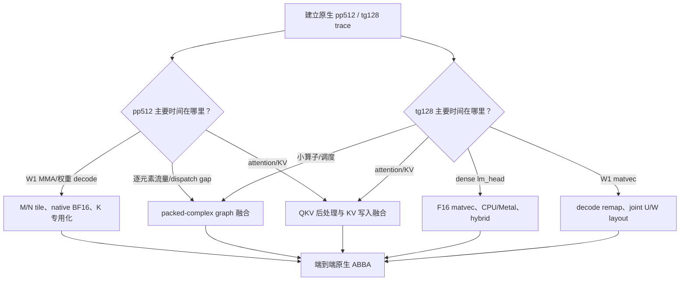

# Fairy2i W1 Metal 进一步压榨硬件性能实验计划

日期：2026-07-17

目标分支：`codex/metal`

当前起点：`1282a95b`（`fairy2i: merge QKV bundle weights for Metal`）

适用模型：Qwen3-8B Fairy2i W1 `bundle_v1`，Apple M4 Metal

## 0. 计划目的与当前判断

本计划的目标不是继续堆叠可切换的实验 kernel，而是先用原生环境的硬件计数器确定 pp512 和 tg128
各自真正受限的位置，再依次验证能够改变端到端瓶颈的方案。每个实验都必须有单独 commit、正确性证据、
原始性能记录和明确的保留/删除结论；失败实现及临时环境变量不得留在最终代码中。

当前的 QKV 合并应视为后续融合的基础布局，而不能再被当作已经确认的性能优化。用户在沙箱外的原生测试
没有观察到预期提升，因此：

- 沙箱内此前得到的 pp512 `+0.57%`、tg128 `+3.95%` 只保留为历史记录，不作为验收证据；
- 新的性能基线必须由用户可直接运行的原生终端、同温度交错测试重新建立；
- 如果 QKV 合并没有被后续的 QKV 后处理融合利用，并且最终原生 ABBA 仍为中性或回退，则应重新比较并
  考虑恢复 separate Q/K/V，避免仅为理论收益增加格式和 loader 复杂度。

最值得优先验证的四条主线是：

1. 消除 graph 中大量 packed-complex 拆分、RMSNorm、RoPE、residual 和 SwiGLU 的中间读写与 dispatch；
2. prefill 改变 M/N tile 比例，使每份权重服务更多 token，减少 pp512 下权重被重复读取的次数；
3. decode 降低每线程累加器和寄存器压力，并针对 W1 的 U/W 双分支重排 code load；
4. 单独剖析并优化 tg128 中体积超过全部低比特 transformer 权重的 dense F16 `lm_head`。

## 1. 为什么 QKV 仅合并 dispatch 不足以提速

### 1.1 pp512 的量级上限

当前 bundle 低比特 transformer 权重 payload 为 `871,612,416 B`。prefill kernel 的 token tile 为 N16，
pp512 需要 32 个 N tile。按每个 N tile 都消费一遍 code 计算，仅权重 payload 的逻辑读取量约为：

```text
871,612,416 B × (512 / 16) = 27,891,597,312 B ≈ 27.9 GB
```

每层 QKV 输入为 2048 个 packed-complex BF16、512 token，大小约 4 MiB。separate Q/K/V staging 三次，
merged QKV staging 一次，最多节省：

```text
4 MiB × 2 × 36 layers = 288 MiB
```

实际 DRAM 流量可能因 GPU cache 命中而低于 27.9 GB，所以后续必须以 profiler 的 device/cache read counter
为准；这里的计算用于说明 kernel 结构中的重复消费量级。288 MiB 只相当于该逻辑权重读取量的约 1%。QKV
合并不减少权重、scale、MMA 或 Q/K/V 后处理，因此 pp512 没有明显提升符合量级预期，不能再从相同思路
期待大幅收益。

### 1.2 tg128 的量级上限

decode 不执行 prefill activation staging。QKV 合并只把每层三个 dispatch 变成一个，数学计算和有效权重
读取量不变。每 token 仍需面对：

- 约 `871.6 MB` 的 Fairy2i 低比特 transformer 权重；
- 约 `1,244,659,712 B` 的 dense F16 `lm_head` 权重；
- KV cache、attention、norm、逐元素算子和 command scheduling。

因此，单纯少 72 个 QKV dispatch/token 不足以保证大幅 tg 提升。tg128 必须先确认时间到底花在 W1 matvec、
`lm_head`、attention/KV cache，还是小 kernel 间隙，再选择优化对象。

### 1.3 当前主 kernel 的结构性限制

prefill W1 主路径为 `32×16/K16`、128 threads、4 个 simdgroup。K=2048 时每个 threadgroup 约经历
128 个 K16 substep 和约 256 次 threadgroup barrier；down projection 的 K=6144 则约为 384 个 substep、
768 次 barrier。当前约 9 KiB threadgroup memory 不高，但累加器、展开后的 live range 和 barrier 可能共同
限制 occupancy。

decode W1 主路径为 `rows8 × block_slots8`、128 threads。每个线程持有 8 个 real 和 8 个 imag FP32
累加器，并在最后进行 SIMD 内及跨 SIMD 的归约。这很可能以寄存器占用换取了 activation 复用，需由 Shader
Profiler 确认是否已经压低 resident threadgroups。

## 2. 不可破坏的约束

### 2.1 默认主线保持的语义

- `bundle_v1` canonical code、learned scale 和 branch order `U0,W0` 必须逐 bit 一致；
- 不允许运行时把全部权重 repack，也不长期保留第二份完整权重；
- 默认优化必须保持现有 BF16/F32 累加及舍入位置；若融合改变了舍入点，必须显式归入“数值变化实验”；
- 旧 separate Q/K/V GGUF 的兼容加载路径不得在没有迁移决定前破坏；
- prefill 和 decode 都必须验证，不能用一个 workload 的提升掩盖另一个 workload 的回退；
- 不并发运行多个 `llama-bench`；不以沙箱数据替代原生终端最终数据。

### 2.2 代码库约束

- 每次只改变一个可解释变量；布局、kernel mapping 和 graph 融合不得一次混改；
- 实验优先使用临时 commit，而不是新增永久环境变量；
- 进入最终分支的只保留胜者、必要兼容路径、转换脚本和验证脚本；
- 失败 kernel、dispatch selector、临时 GGUF 和中间权重必须删除；
- C/C++ 改动执行 scoped `git clang-format` 和 touched-source `clang-tidy`；
- 每个阶段都执行 `git diff --check`，最终 Release Metal build 必须干净通过。

## 3. 测量体系：先知道 GPU 在等什么

### 3.1 固定基线

第一轮不得改代码，只建立以下基线记录：

| 项目 | 必须记录的内容 |
| --- | --- |
| 代码 | commit、dirty status、编译器、Metal language version、CMake flags |
| 机器 | Mac 型号、SoC、RAM、macOS、低电量模式、电源状态 |
| 模型 | 绝对路径、文件大小、SHA256、GGUF layout metadata |
| 运行 | 完整命令、环境变量、threads、batch、ubatch、Flash Attention、GPU layers |
| 温度 | 冷启动样本、预热后样本、测试顺序、每段开始/结束时间 |
| 输出 | 原始 JSON、stderr/path marker、汇总脚本输出、trace 绝对路径 |

当前候选模型：

```text
OLD=/Users/a1806/llama/qwen_1bit_scale/qwen3-fairy2i-w1-bundle-v1.gguf
QKV=/Users/a1806/llama/qwen_1bit_scale/qwen3-fairy2i-w1-bundle-v1-qkv.gguf
```

标准原生命令模板：

```bash
ROOT=/Users/a1806/.codex/worktrees/0a47/llama.cpp
BENCH="$ROOT/build-rel-metal/bin/llama-bench"
MODEL=/Users/a1806/llama/qwen_1bit_scale/qwen3-fairy2i-w1-bundle-v1-qkv.gguf

"$BENCH" -m "$MODEL" -ngl 99 -fa 1 -t 8 -p 512 -n 128 -r 5 -o json
```

最终比较使用 ABBA 或 BAAB，单段 R3 用于筛选，胜者再做交错 R5。每轮应先做 control-vs-control，量出同一
binary 的温漂和随机区间。没有超过 control 漂移的差异一律记为“中性”。

### 3.2 必须补齐的 profiling

使用 Xcode Metal System Trace/Shader Profiler，分别采集纯 pp512 和纯 tg128，不用混合 run 推断单项瓶颈。
需要在 Fairy2i pipeline、encoder 和 graph op 上补充稳定 label/signpost，使 trace 至少能区分：

- W1 QKV、O、gate、up、down；
- activation staging；
- packed-complex split/merge、RMSNorm、RoPE、residual、SwiGLU；
- flash attention 和 KV cache copy/convert；
- dense F16 output head；
- command buffer/encoder 间隙。

每个关键 kernel 记录：GPU 总时间占比、dispatch 数、threads/TG、registers/thread、threadgroup memory、
occupancy、ALU/MMA utilization、device/cache read bytes、barrier stall、相邻 dispatch gap。若工具不能提供某个
计数器，明确写“不可得”，不能用估算冒充实测。

### 3.3 shape microbenchmark

端到端测试之外，建立只用于筛选的 op microbenchmark，覆盖真实 shape：

| projection | M | K | N |
| --- | ---: | ---: | ---: |
| QKV | 3072 | 2048 | 1、512 |
| O | 2048 | 2048 | 1、512 |
| gate | 6144 | 2048 | 1、512 |
| up | 6144 | 2048 | 1、512 |
| down | 2048 | 6144 | 1、512 |
| dense output | vocab | 4096 | 1，以及实际 pp 输出 token 数 |

microbenchmark 必须复用真实 converter 产生的布局和真实 Metal dispatch，不允许把 synthetic buffer 的 cache
命中结果直接当作 GGUF 端到端结论。它只负责快速淘汰明显失败的 kernel。

### 3.4 瓶颈决策树



## 4. 全部候选优化点总表

下表的“潜力”是待 profiling 验证的工程优先级，不是性能承诺。

| ID | 候选 | 主要 workload | 潜力 | 风险/成本 | 初始优先级 |
| --- | --- | --- | --- | --- | --- |
| M0 | 完整 native trace、op label、control 漂移 | pp/tg | 决策基础 | 低 | P0 |
| R1 | `GGML_METAL_N_CB` 1/2/3/4 sweep | pp/tg | 小到中 | 低 | P0 |
| R2 | concurrency/fusion/graph-optimize ablation | pp/tg | 诊断 | 低 | P0 |
| R3 | ubatch 128/256/512/1024 | pp | 小到中 | 低 | P0 |
| R4 | residency、mmap、buffer mode ablation | pp/tg | 小 | 低 | P1 |
| R5 | separate projection 并发与 merged 大 dispatch 对照 | pp/tg | 小到中 | 低中 | P1 |
| R6 | pipeline/argument binding/command encoding 精简 | pp/tg | 小到中 | 中高 | P2 |
| G1 | packed-complex RMSNorm 单 kernel | pp/tg | 中 | 中 | P0 |
| G2 | O/down linear + residual epilogue | pp/tg | 中 | 中 | P1 |
| G3 | Q/K RMSNorm + RoPE + V split 融合 | pp/tg | 高 | 中高 | P0 |
| G4 | QKV linear 直接写 attention-ready 展开布局 | pp/tg | 高 | 高 | P1 |
| G5 | gate/up 合并 dispatch | pp/tg | 小 | 低中 | P2 |
| G6 | gate/up 联合计算并直接输出 SwiGLU | pp/tg | 高 | 高 | P1 |
| G7 | attention 输出直接供 O projection 消费 | pp/tg | 中 | 高 | P2 |
| G8 | residual add 与下一 RMSNorm 融合 | pp/tg | 中高 | 高 | P2 |
| G9 | K/V 后处理直接写 KV cache | pp/tg | 中高 | 高 | P1 |
| G10 | dead-node、无用 scratch、重复 copy 审计 | pp/tg | 小 | 低 | P0 |
| P1 | 固定输出面积的 M/N tile sweep | pp | 高 | 中 | P0 |
| P2 | 按 N 自适应 N8/N16/N32 | pp | 中高 | 中 | P1 |
| P3 | native BF16 simdgroup MMA | pp | 高 | 中高 | P1 |
| P4 | 去掉全局 BF16→FP16 activation staging | pp | 中 | 中 | P1 |
| P5 | K=2048/K=6144 shape 专用 kernel | pp | 中 | 中 | P1 |
| P6 | 64-bit 地址计算改为可证明安全的 32-bit offset | pp/tg | 小 | 低 | P2 |
| P7 | scale broadcast/hoist、code decode 减法 | pp/tg | 小到中 | 中 | P2 |
| P8 | K-loop ping-pong staging/降低 barrier | pp | 中 | 高 | P2 |
| P9 | persistent tile/layer kernel | pp | 高 | 很高 | P3 |
| D1 | 每个 simdgroup 独立负责 row 子集 | tg | 中高 | 中 | P0 |
| D2 | 32/64/128/256 threads 与 rows4/8/16 重扫 | tg | 中 | 中 | P1 |
| D3 | U/W joint load 与向量化 bit decode | tg | 高 | 中高 | P1 |
| D4 | K32/K96 function-constant 完全专用展开 | tg | 中 | 中 | P1 |
| D5 | `float2` complex accum、归约和地址运算精简 | tg | 小到中 | 中 | P2 |
| D6 | 移除 decode 未使用的 extra activation scratch | tg/内存 | 小 | 低 | P0 |
| L1 | joint U/W code packet | tg，兼顾 pp | 高 | 高 | P1 |
| L2 | decode-coalesced M8 panel | tg | 高 | 高 | P1 |
| L3 | prefill-coalesced M32/K16 packet | pp | 高 | 高 | P1 |
| L4 | scale 内联到 M32/M64 macro packet | pp/tg | 中 | 高 | P2 |
| L5 | codes/scales 合并为单 storage buffer | pp/tg | 小到中 | 中高 | P2 |
| L6 | per-layer superbuffer/argument buffer | pp/tg | 小 | 高 | P3 |
| O1 | dense head Metal 与 CPU NEON 对照 | tg | 诊断/可能高 | 低 | P0 |
| O2 | dense F16 Metal matvec 专用化 | tg | 高 | 中高 | P0/P1 |
| O3 | CPU/GPU vocabulary 分片并行 | tg | 中高 | 很高 | P2 |
| O4 | logits 写回与 top-k/sampling 融合 | tg | 小到中 | 高 | P3 |
| X1 | 3-MMA complex 乘法/Gauss 变换 | pp | 很高 | 改变舍入 | 激进 |
| X2 | 量化 `lm_head` | tg | 很高 | 改变质量 | 激进 |
| X3 | 量化 KV cache | 长上下文 tg | 中高 | 改变质量 | 激进 |
| X4 | 近似 vocab pruning/two-stage head | tg | 很高 | 改变 logits | 激进 |
| X5 | 局部预展开/缓存热层系数 | pp/tg | 不确定 | 内存很高 | 激进 |

## 5. 阶段 A：原生基线、调度和无代码诊断

### A1. separate 与 merged QKV 重新定性

执行 OLD/QKV 的 ABBA 与 BAAB，至少各一轮 R5。记录 pp512、tg128 的全部样本，不只记录均值。结论分为：

- 明确胜出：超过 control 漂移及保留门槛；
- 中性：置信区间重叠或差值低于噪声；
- 回退：反向超过门槛。

merged QKV 即使中性也可暂时保留到阶段 C，因为它显著简化 QKV 后处理融合；阶段 C 结束后再做最终去留。

### A2. runtime ablation

不改模型和 shader，逐项扫：

```text
GGML_METAL_N_CB=1,2,3,4
GGML_METAL_CONCURRENCY_DISABLE=0/1
GGML_METAL_FUSION_DISABLE=0/1
GGML_METAL_GRAPH_OPTIMIZE_DISABLE=0/1
GGML_METAL_NO_RESIDENCY=0/1
n_ubatch=128,256,512,1024
mmap=on/off
```

这些开关主要用于判断 command-buffer overlap、graph fusion、residency 和工作集大小，不应全部暴露成最终用户
调参项。若某个固定值在目标机器稳定胜出，应优先改成 Fairy2i 路径的合理默认或内部策略；若只在单次 run
胜出则删除结论。

还要从 trace 检查 separate Q/K/V 或 gate/up 是否曾被 Metal concurrency 调度为可重叠工作。merged 大 dispatch
可能减少固定开销，也可能失去独立 projection 的排队/占用机会。若确有重叠，比较“separate projection + 一次
共享 staging”和 merged dispatch，但不得恢复此前无收益的通用 activation cache 作为长期路径。

若 tg trace 显示 CPU command encoding 或 pipeline/resource binding 形成明显 GPU 空洞，再评估 argument buffer、
function-constant pipeline 预热、减少 encoder 切换或更粗粒度 command recording；GPU 已连续满载时不做这类改动。

### A3. graph 和内存审计

用 `GGML_METAL_GRAPH_DEBUG=2` 统计每层/每 token 的 op 数，确认：

- `build_complex_conj()` 为 bundle path 创建的值是否被 graph pruning；若仍执行，直接移除无用计算；
- decode 时 `extra_act_q`/`extra_act_d` 是否分配但未被 kernel 读取；先移除无用 scratch，再验证峰值内存和性能；
- QKV views 是否触发隐式 contiguous/copy；
- K/V cache 写入前是否发生重复 split、cast 或 copy；
- gate/up 是否对同一输入做两次完全相同的 global staging；
- output head 在 pp512 实际计算多少 token 的 logits，避免错误估算其 prefill 占比。

阶段 A 交付物：一份原生 baseline JSON 汇总、一份 pp trace、一份 tg trace、按 GPU 时间排序的 top-20 kernel
表，以及后续阶段优先级的确认/调整。

## 6. 阶段 B：packed-complex graph 融合

这一阶段优先消灭“读出 packed BF16 → 写 F32 real/imag → 逐元素处理 → 再写 packed BF16”的往返流量。
与只合并 matmul dispatch 相比，它直接减少 kernel、intermediate tensor 和显存访问。

### B1. packed-complex RMSNorm

当前每个 attention norm、FFN norm 和 final norm 都经过：

```text
complex_split -> generic RMSNorm -> complex_merge
```

36 层中 attention/FFN 各一次，外加 final norm，共 73 处。实现一个直接读取 packed-complex BF16、以 F32
计算统计量和缩放、再按原位置舍入为 packed BF16 的专用 op/kernel，可把每处 3 个 op 降为 1 个，理论上
减少 146 个 dispatch/graph，并移除 real/imag F32 intermediate。

执行顺序：

1. 用 reference CPU 实现锁定当前统计维度、epsilon 和 BF16 舍入点；
2. 先实现独立 Metal kernel，不与 linear 融合；
3. 做随机 shape、极值、NaN/Inf 和真实 layer tensor 对照；
4. 分别测 pp/tg；若端到端胜出才替换 graph；
5. 若性能中性，检查 trace 是否被 generic Metal fusion 已经覆盖，避免保留重复专用 op。

### B2. linear + residual epilogue

每层 O projection 和 down projection 后都有 complex residual add，共 72 处。候选方案是让 wide-linear kernel
在写输出时读取 residual，并执行当前的“linear 输出先 BF16 round，再 unpack/add、再 BF16 round”语义。
不能直接把 F32 accumulator 与 residual 相加后只 round 一次，除非归入数值变化实验。

先做 decode，因为 N=1 时额外 residual load 容易嵌入现有 output row kernel；prefill 需确认 epilogue 不扩大
threadgroup output tile 或降低 occupancy。若必须额外存回再读才能维持舍入，则收益可能消失，应立即淘汰。

### B3. residual + 下一层 norm 跨 op 融合

更激进但仍可保持语义的方案：

- attention O residual add 同时生成 FFN norm 所需统计和归一化结果；
- FFN down residual add 同时生成下一层 attention norm 输入。

难点是 residual 结果本身仍需作为下一次 skip connection 保存，且 RMSNorm 是整行归约。可设计一个有两个 view
输出的 structured op，或先做 fused add+partial-sum、再做短 finalize kernel。只有 B1/B2 后 trace 仍显示这部分
显著，才进入该实验。

## 7. 阶段 C：把 QKV 合并转化为真正的数据流融合

### C1. QKV fused postprocess

当前 merged QKV matmul 后仍执行：

```text
Q/K/V 三次 complex_split
Q、K 两次 head RMSNorm
Q、K 两次 RoPE
V 的布局/类型准备
```

设计一个 QKV postprocess kernel，单次读取 merged packed output，并生成 attention 直接消费的连续输出：

- Q：按 head_dim=128 做 Q RMSNorm，再做 RoPE；
- K：按 head_dim=128 做 K RMSNorm，再做 RoPE；
- V：展开/转换成 flash-attention 或 KV cache 所需格式；
- K/V：条件允许时直接写入最终 KV cache 位置，避免中间 tensor 和后续 copy。

优先实现为一个独立 kernel，而不是立刻塞进 matmul epilogue。原因是当前 matmul row tile=32，小于完整
head_dim=128；在线性 epilogue 内做 head norm 会引入跨 threadgroup 归约或额外同步。独立 postprocess 仍能把
每层约 7 个小 op 收敛为 1～2 个，并保持职责清晰。

正确性必须分别比较 pre-RoPE、post-RoPE、K cache、V cache，不只比较最终文本。需覆盖 pp、单 token decode、
不同 position 和 GQA 的 32 Q heads/8 KV heads。

### C2. QKV linear 直接写 expanded/attention-ready 输出

若 C1 仍被读取 packed intermediate 的带宽限制，可让 QKV wide-linear 写出当前 split 后的 layout。为了保持
语义，F32 accumulator 必须先模拟原 packed BF16 round，再扩展成后续 kernel 使用的 F32/F16；否则输出与当前
路径不同。

候选写法：

```text
[Q.real, Q.imag, K.real, K.imag, V.real, V.imag]
```

或直接按 `[token, head, position-pair, complex-component]` 写为 attention-ready layout。两者只选 trace 证明
后续访问最连续的一种，不同时保留多种 GGUF/graph 选项。

### C3. merged QKV 最终去留

C1/C2 完成后做三方对照：

1. separate Q/K/V 原路径；
2. merged QKV 但无 fused postprocess；
3. merged QKV + fused postprocess。

如果只有第 3 项明显胜出，则在报告中明确 QKV merge 是融合前置条件；如果第 3 项仍未超过 separate，撤销
merged 格式的性能主张，并评估是否值得仅因 tensor 数减少而保留。

## 8. 阶段 D：gate/up 与 SwiGLU 联合

### D1. 仅合并 gate/up 作为上限探针

gate 和 up 都是 M=6144、K=2048，读取相同输入。把两者拼为 M=12288 只能减少一次 activation staging 和
一个 dispatch，权重/MMA 量不变，预期与 QKV 单纯合并一样有限。该实验只作为低成本上限探针，不应直接成为
最终设计。

### D2. interleaved gate/up + fused SwiGLU

真正高潜力方案是按对应 output row 交织 gate/up 权重，使同一个 threadgroup 计算相同行范围的两个 projection，
随后直接输出：

```text
SiLU(gate) * up
```

这样可以消除两个完整 M=6144 wide output、两次 split、SiLU、mul 和 merge intermediate。布局候选为以 M64
macro tile 为单位 `[gate tile, up tile]`，或在更细 row packet 中交织；先从不改变 bundle 内 canonical code
的 macro-tile 交织开始。

prefill 需防止同时保留 gate/up accumulator 导致寄存器翻倍。可比较：

- 同 TG 同时累加 gate/up：最大化 input/scale 复用，寄存器压力最高；
- 同 TG 两个 pass：复用 staged activation，但不同时保留两套 accumulator；
- row tile 减半、N tile 增大：保持总 output area，给双 projection 腾出寄存器。

decode 可在 row8 内联合累加，或者让两个 simdgroup 分别算 gate/up 后通过 threadgroup memory 做短 epilogue。
任何版本都必须与当前逐 op BF16 舍入位置逐项核对。

## 9. 阶段 E：prefill 主 kernel 的权重摊销和硬件利用率

### E1. 固定 output area 的 M/N tile sweep（最高优先级）

历史 sweep 主要固定 N16 只改变 M，已经证明 M64×N16 和更大 K live range 会回退。但尚未验证“减少 M、
增加 N”，这正是降低 pp512 权重重复读取的直接手段。

优先比较以下相同 output area 的 tile：

| tile | pp512 每个 M tile 的 N dispatch 数 | 主要假设 |
| --- | ---: | --- |
| M64×N8 | 64 | 更多 row/code 复用，token 摊销差 |
| M32×N16 | 32 | 当前基线 |
| M16×N32 | 16 | 权重读取次数约减半，累加器压力上升 |
| M8×N64 | 8 | 权重摊销最大，可能因寄存器/occupancy 失败 |

总 output element 数和大致 threadgroup 数可保持相近，因此该 sweep 能更干净地揭示“权重流量 vs accumulator
压力”的平衡。每个点必须记录 registers/thread、occupancy、device read bytes 和 MMA utilization；仅看 tok/s
无法解释失败原因。

若 M16×N32 胜出，再验证按 N 自适应：小 prompt 用 N8/N16，N>=32 用 N32。不要在结论前留下运行时 selector。

### E2. native BF16 simdgroup MMA

M4 支持 BF16，代码库已有 `simdgroup_bfloat8x8` 用法。验证 Metal compiler 是否能让 Fairy2i coefficient 和
activation 直接以 BF16 进入 simdgroup matrix，目标是移除全局 BF16→FP16 staging 或至少移除 conversion。

实验拆成两步：

1. 只替换 activation matrix 类型，保持 coefficient 和 tile mapping；
2. 再验证 coefficient staging 使用 BF16 是否减少转换/寄存器而不降低 MMA throughput。

需要检查 native BF16 的实际 shader ISA 和吞吐，不能仅因源码类型是 `bfloat` 就认定走了 BF16 硬件。数值比较
应明确当前 BF16→FP16 是否无损、coefficient rounding 是否变化。

### E3. K shape 专用化

当前一个 W1 prefill kernel 同时覆盖 K2048 和 K6144。分别生成 function-constant 或独立编译实例：

- K2048：QKV/O/gate/up，固定 32 个 K64 block；
- K6144：down，固定 96 个 K64 block。

对 K6144 单独重测 K8/K16/K32；K32 可能减少 barrier，但历史 K64 因 16 KiB coefficient state 和 live range
失败，所以不得直接放大到 K64。用编译后 register 数和 occupancy 决定，不以理论 barrier 数决定。

### E4. barrier 与 staging

依次尝试：

- 把能由 SIMD 内保证的同步从 TG barrier 缩小，但不得复制四份 activation；
- coefficient/activation 使用双 buffer，当前 MMA 消费 buffer A 时准备 buffer B；
- 若 MSL/硬件支持有效异步 copy，再验证 copy/compute overlap；
- 减少 substep 间不必要的全 TG barrier，使用明确的数据依赖证明安全。

历史 SIMD-local activation 方案因每个 SIMD 重读 activation 约慢 15%，不得原样重试。只有新的 N tile 或异步
copy 改变了流量前提时才可重新评估。

### E5. 指令级小优化

这些项目只在 Shader Profiler/ISA 表明相关开销可见时执行：

- `ulong` code/scale offset 改为经 bounds 证明安全的 `uint`；
- U/W nibble 一次向量 load 后共同 decode；
- scale 从每 lane 重复 load 改为硬件可广播的 scalar load；
- 把每 K64 不变的 scale、base pointer、stride 提出 inner loop；
- 代数化简 code→coefficient 的 `select`、mask、sign 和 complex branch 组合；
- 在不改变舍入的前提下把 scale 从逐 coefficient 乘法提升到 partial accumulator。

scale lane0+shuffle 在旧 decode 实验中曾回退，因此任何 broadcast 方案都必须先看生成 ISA，并与直接 load
做相邻 microbenchmark。

### E6. persistent kernel（仅作为远期方案）

让一个 threadgroup 连续处理同一 projection 的多个 N tile 或 M panel，可以增加权重/activation 的局部复用并
减少 dispatch，但可能降低并行度、增加寄存器、触发长 kernel/watchdog。只有 E1～E5 仍显示大量重复 device
read 且 occupancy 有余量时才进入，不应作为首轮重写目标。

## 10. 阶段 F：decode W1 matvec

### F1. 改变工作分配，降低 16 个 FP32 accumulator/thread

当前 row8 kernel 让每线程持有 8 real + 8 imag accumulator，最后还需跨 4 个 simdgroup 归约。新映射优先
尝试：

- 一个 simdgroup 独立完成 2 或 4 个 output row，取消跨 SIMD 归约；
- 两个 simdgroup 负责一个 row group，在 activation 重读和寄存器之间折中；
- 一个 TG 处理更多 row，但每线程只持有较少 row accumulator。

这不是简单重跑旧 rows4/8/16 sweep；只有 work ownership 和 reduction topology 改变才值得实验。必须记录
occupancy、register spill、activation read 和 SIMD utilization，确认“少 accumulator”没有被 activation 重读抵消。

### F2. threadgroup/thread 数与固定 shape

在 F1 最佳 mapping 上扫 32/64/128/256 threads，以及 rows4/8/16。K2048 固定 32 block、K6144 固定 96 block，
分别生成完全展开/有界展开实例，移除通用 bounds 和动态 stride。QKV/O/gate/up 与 down 可以选择不同 decode
kernel，最终最多保留两个真实 shape 专用实例。

### F3. joint U/W code decode

当前 U0/W0 branch 分开寻址和 load。设计一个 Metal-specific packet，使一个对齐 vector load 同时得到同一 row、
同一 q4 的 U/W code，随后一次 mask/shift 派生两个 branch。目标是减少 load 指令、地址流和 bit decode，而不是
增加 scale 重复。

先用临时 repacker + microbenchmark 证明 D3；只有 decode op 至少提升 5%，再扩展 converter 和 full GGUF。
不要为实验长期保存第二份完整模型。

### F4. complex 算术和归约

检查生成 ISA 后依次验证：

- real/imag accumulator 用 `float2` 是否生成更好的向量 FMA；
- complex branch 的符号组合是否可由 xor/sign-bit 或更少 `select` 完成；
- `simd_sum` 与 TG scratch 的写入能否通过新的 ownership 完全移除；
- scale 是否可在 q4/block 粒度只加载一次；
- 地址 base/stride 是否可全部 32-bit 化并循环外提。

不得把 FP32 accumulator 改为 FP16 来换性能，除非单独归入数值变化实验。

### F5. decode scratch 和调度

`act_rows==1` 的 direct BF16 decode 不使用 prefill activation scratch。移除无用 extra buffer allocation，检查
scheduler 是否因 buffer footprint、alias 或 residency 得到改善。这项很可能只降低内存占用；若 tok/s 中性，
可以因代码/内存简化保留，但报告不得宣称性能提升。

## 11. 阶段 G：Metal-specific 权重布局

只有 profile 证明 code load、地址计算或 cache transaction 是主要瓶颈时才修改 GGUF。每种布局先由独立
repacker 从 canonical bundle 产生临时文件，胜出后才并入正式 converter。

### G1. 布局候选

1. **Joint U/W packet**：同一 row/q4 的 U、W 放入一个 16-bit 或 vector-friendly packet；decode 优先。
2. **M8 decode panel**：`[tile][m16][row_group8][q4][row8][joint_UW]`，让 SIMD lane 对应的 code load 连续。
3. **M32/K16 prefill packet**：按当前 128-thread coefficient construction 的实际访问顺序排列 code，减少
   scattered load 和 shuffle。
4. **M16/N32 对应 packet**：若 E1 胜者改变 row tile，布局必须跟随胜者，不能先为旧 tile 固化新格式。
5. **Scale inline macro packet**：每个 M32/M64 macro tile 附近放 scale，减少独立 scale 地址流；避免恢复 V2
   那种大量重复 scale 的格式。
6. **Codes/scales 单 storage tensor**：用明确 offset view 同时读取，减少 binding/resource 和独立 base pointer。
7. **Per-layer superbuffer/argument buffer**：把一层的 QKV/O/gate/up/down 资源集中，主要减少 resource/地址
   切换；只有 trace 显示 binding/TLB 问题才做。
8. **双用途折中布局**：macro 层保持 M64/K64 canonical 顺序，macro 内按 decode row8 与 prefill M16/M32
   都能向量读取的最小 packet 排列，避免为 pp/tg 各保留一份权重。

### G2. 布局验收顺序

```text
canonical pack unit test
-> repacker bit-exact inverse test
-> synthetic kernel microbench
-> converter-produced full GGUF
-> full-file canonical validator
-> deterministic generation
-> pp512/tg128 native ABBA
```

布局改变维护成本高，进入最终代码至少要满足目标 workload 端到端 `+3%`，且另一个 workload 不回退超过
`0.5%`。低于该门槛不值得新增 metadata、loader 分支和转换格式。

## 12. 阶段 H：dense F16 output head

Qwen3-8B 的 dense F16 `lm_head` 约 1.245 GB，大于全部低比特 transformer 权重。在 tg128 中每 token 都需要
访问它，极有可能决定 decode 上限，必须与 W1 kernel 同等优先地剖析。

### H1. 路径对照

先比较默认 Metal output 与已有 `LLAMA_FAIRY2I_OUTPUT_NEON=1` CPU/NEON 路径，记录 GPU、CPU 和统一内存带宽。
该开关仍只用于实验；胜者应通过内部 shape/hardware 策略选择，避免要求最终用户手调。

### H2. exact F16 Metal matvec

针对 `M=vocab, K=4096, N=1` 做专用 kernel，实验：

- row tile、SIMD ownership 和 vector load 宽度；
- input activation 在 TG/SIMD 内的复用；
- output vocabulary 分片和连续 F16 weight traversal；
- accumulator/reduction topology；
- pipeline 与 transformer decode 是否可在 command buffer 上更好重叠。

先确认当前 generic kernel 的实际 weight orientation；若转换时转置/pack 可让每个 SIMD 连续读取，则做临时
head-only repack 验证，再决定是否修改 converter。

### H3. CPU/GPU 混合

统一内存使 CPU 和 GPU 可分别计算 vocabulary 的连续区间，再拼接 logits。该方案可能利用两套计算资源，也
可能因共享内存带宽竞争更慢。需要 sweep 25/75、50/50、75/25 分片，并记录 CPU 能耗、GPU 空洞和总延迟。
只有 Metal/CPU 单独路径都受计算而不是 DRAM 带宽限制时才有较大成功机会。

### H4. logits 后处理

如果 trace 显示 logits 写回、top-k 或 sampling 占比明显，可把 logits finalize 与 top-k reduction 融合，减少
大 vocabulary 输出流量。但这不会减少 1.245 GB head weight read，所以优先级低于 H2。

## 13. attention 与 KV cache 的补充候选

这些项目依据 trace 选择，不预设 flash attention 是瓶颈：

- C1 中 Q/K norm+RoPE 融合后，直接写 flash-attention 期望 layout；
- K/V 的 BF16/F16 转换与 KV cache write 合并，避免 temporary 和 `cpy/set_rows`；
- attention 输出若为 split real/imag，让 O projection 增加直接消费该 layout 的入口，省掉 complex merge；
- 对 head_dim=128、32 Q heads、8 KV heads 做专用 attention shape 检查，但优先复用现有 Flash Attention；
- 长上下文单独测 KV cache 带宽，不能用 tg128 的短上下文结果推断长上下文。

## 14. 激进方案：先记录，未经授权不进入默认实现

### X1. 3-MMA complex 乘法

用 Gauss 形式把四个 real MMA 降为三个，理论上最多减少 25% 相关 MMA，但会增加输入/输出加法、改变浮点
求和顺序和舍入。可先做 op-level 数值/性能试验；只有硬件 MMA 明显主导且用户接受数值变化时才考虑。

另一个变体是把 complex 乘法写成更大的 real block matrix，一次处理 real/imag。它可能减少 dispatch/控制流，
也可能因矩阵尺寸和 coefficient expansion 增加流量，应以 microbenchmark 决定。

### X2. 量化 output head

将 1.245 GB F16 `lm_head` 量化到 Q8/Q6/Q4 或 Fairy2i，可能是 tg128 最大的单点收益，但会改变 logits 和模型
质量。必须使用独立 GGUF variant，执行固定 prompt generation、perplexity/任务质量和 top-k 一致率，不得悄悄
替换 exact 默认路径。

### X3. 量化 KV cache

对短 tg128 可能收益有限，对长上下文更有价值。必须单独评估上下文长度 512/2k/8k/更长时的带宽、质量和
内存，不能与 exact 主线混为一个结论。

### X4. 两阶段 vocabulary pruning

先用低精度/低秩 head 找 candidate vocabulary，再只对候选做 exact F16，可大幅减少平均计算，但不能保证完整
logits 或采样等价，属于算法变化。只适用于明确允许近似的独立模式。

### X5. 局部系数预展开或热层 cache

把 2-bit code 临时展开成 FP16/BF16 可减少重复 decode 指令，但容量膨胀约 8 倍，并会争抢统一内存/cache。
仅可测试一个 layer/tile 的短生命周期 scratch 或 persistent kernel 内 cache，不允许保存第二份全模型展开权重。

## 15. 已知失败路线与重试条件

| 已试路线 | 历史结论 | 何时才允许重试 |
| --- | --- | --- |
| 仅做显式 graph activation cache | 中性/有 cache 风险 | 新融合能同时消除大 intermediate 时 |
| 仅合并 QKV dispatch | 原生未见预期提升 | 与 C1/C2 fused postprocess 绑定 |
| 仅合并 gate/up dispatch | 尚未做，但理论上限与 QKV 类似 | 作为 D2 的短探针，不独立长期保留 |
| 旧 BF16-direct prefill | 慢于 retained half MMA | native BF16 simdgroup ISA 前提变化时 |
| q8 activation prefill | 明显回退 | 不重试，除非硬件/格式完全变化 |
| SIMD-local activation copies | 约慢 15% | 新 N tile/异步 copy 改变读取次数时 |
| M64×N16 | 慢于 M32×N16 | 只在 N 同时缩小/映射重写时 |
| K64 prefill | 16 KiB state/live range 导致回退 | 不原样重试；最多从 shape-specific K32 开始 |
| 旧 decode rows4/16 sweep | 未胜出 | F1 改变 ownership/reduction 后 |
| scale lane0 + shuffle | 慢于直接 load | ISA 显示硬件 broadcast 或新 joint layout 后 |
| q16 activation decode | 额外量化无收益 | 不重试 |
| threadgroup LUT decode | 同步/流量回退 | 不重试；除非 LUT 完全驻留且无 TG barrier |

“重试条件”必须在实验记录中具体说明，不能只换 kernel 名称后重复同一路线。

## 16. 执行顺序与停止条件

### Phase 0：测量闭环

- [ ] A1 原生 OLD/QKV ABBA+BAAB R5
- [ ] A2 runtime ablation
- [ ] A3 graph/scratch 审计
- [ ] pp/tg Shader Profiler + top-20 时间表
- [ ] output head 独立占比与 Metal/NEON 对照

停止条件：没有能识别主要 kernel 或温漂大于候选差异时，不进入大改；先修 profiling/测试环境。

### Phase 1：高收益 graph 流量

- [ ] B1 packed RMSNorm
- [ ] C1 QKV fused postprocess
- [ ] G9/C1 K/V cache direct write
- [ ] B2 residual epilogue
- [ ] D1 gate/up merge 上限探针
- [ ] D2 fused SwiGLU（仅在 gate/up/SwiGLU 占比足够时）

停止条件：某 op 在 baseline 中占比低于 3%，且理论消除后的端到端上限低于 control 漂移，则不实现。

### Phase 2：主 kernel

- [ ] E1 M64×N8 / M32×N16 / M16×N32 / M8×N64
- [ ] E2 native BF16
- [ ] E3 K2048/K6144 专用化
- [ ] E4 barrier/double buffer（由 stall counter 触发）
- [ ] F1 decode ownership/remap
- [ ] F2 thread/row sweep
- [ ] F4 complex/归约 ISA 精简

停止条件：microbenchmark 未达到 `+5%`，或根据 baseline 占比推算端到端不足 `+1%`，不进入 full model。

### Phase 3：布局

- [ ] G1 joint U/W packet
- [ ] G2 decode M8 panel
- [ ] G3/E1 胜者对应的 prefill packet
- [ ] full converter、validator、GGUF、原生 ABBA

停止条件：full GGUF 目标 workload 未达到 `+3%`，立即回退并删除 layout 分支。

### Phase 4：output head 与激进选项

- [ ] H2 exact F16 Metal matvec
- [ ] H3 CPU/GPU split（仅在带宽计数允许时）
- [ ] X1～X5 仅在用户明确选择数值/质量 trade-off 后执行

### Phase 5：清理和最终报告

- [ ] 删除所有失败 kernel、selector、临时 metadata 和临时权重
- [ ] converter/validator 留下唯一胜出布局
- [ ] Release build、targeted tests、format/tidy
- [ ] 最终 native ABBA/BAAB R5
- [ ] 报告所有实验，包括失败项、原始日志路径和回退 commit

## 17. 正确性和性能保留门槛

### 17.1 正确性门槛

每个 exact-path 候选至少完成：

- bundle pack/merge/repack unit tests；
- full-file canonical validator；
- `test-fairy2i-loader`；
- `test-fairy2i` Metal W1/W2 targeted suite；
- 固定 seed、`temp=0` 的 prompt+32 token generation 对照；
- 涉及融合时的 op-level tensor 对照，包括 stride/view/non-contiguous case；
- 涉及 QKV/KV 时的 prefill、decode、不同 position、GQA cache 对照；
- 涉及舍入位置时优先要求 bit-exact；无法 bit-exact 必须转入数值变化实验并补 perplexity/质量测试。

### 17.2 性能门槛

先由 control-vs-control 得到原生噪声 `D`。建议使用：

| 变更类型 | 保留条件 |
| --- | --- |
| microbenchmark kernel | 目标 op `>= +5%`，且无 register spill/异常 occupancy |
| pp 专用 exact 优化 | pp512 `>= max(+2%, 3D)`；tg128 不低于 `-0.5%` |
| tg 专用 exact 优化 | tg128 `>= max(+2%, 3D)`；pp512 不低于 `-0.5%` |
| pp/tg 通用优化 | 两者均 `>= max(+1.5%, 3D)` |
| 新 GGUF/layout | 目标 workload `>= max(+3%, 3D)`；非目标不低于 `-0.5%` |
| 纯代码/内存简化 | 可在性能中性时保留，但不得计为性能胜者 |

若 control 漂移不是单个百分比，可用交错样本 bootstrap/置信区间判断；核心原则是效果必须稳定大于环境噪声。
任何只在冷机第一段出现、反序后消失的提升都判为失败。

## 18. 单项实验记录模板

后续每个实验复制以下模板，保证跨上下文后仍可继续执行：

```text
Experiment ID:
Status: proposed / running / keep / reject / blocked
Hypothesis:
Baseline commit:
Candidate commit:
Changed files:
Changed invariant/layout:
Build command and result:
Correctness commands and result:
Microbenchmark shape and raw artifact:
pp512 command and raw JSON:
tg128 command and raw JSON:
ABBA/BAAB order:
Control drift:
Profiler trace:
Kernel time/register/occupancy/read-byte delta:
End-to-end mean delta:
Thermal/system notes:
Decision and reason:
Revert/cleanup commit:
```

建议结果目录按实验 ID 固定：

```text
tmp/fairy2i-w1-metal-saturation/<experiment-id>/
  build.log
  correctness.log
  microbench.json
  pp512-a.json
  pp512-b.json
  tg128-a.json
  tg128-b.json
  profiler.trace
  summary.md
```

## 19. 预期最终交付

最终报告必须包含：

1. 原生 baseline 与 control 漂移；
2. 每个候选的假设、实现、pp512、tg128、硬件计数器和保留/淘汰理由；
3. separate QKV、merged QKV、merged+fused postprocess 的最终对照；
4. 最终权重物理布局的逐维定义、offset 公式、converter 和 inverse validator；
5. Metal prefill/decode 的 threadgroup、simdgroup、row/token/K 分工图；
6. 最终保留 kernel 的 register、TG memory、occupancy、dispatch 数和主要流量；
7. 所有失败路线清单，防止后续重复；
8. 用户可直接在原生终端复现的绝对路径命令及原始 JSON/trace 路径；
9. 最终代码中不残留多余实验选项，模型权重不提交到仓库。

本轮计划的成功标准不是“实现了最多的想法”，而是用可复现证据留下最少、最快的路径。优先顺序可由 Phase 0
trace 调整，但每个调整都必须写明是哪个硬件计数器推翻了原假设。
