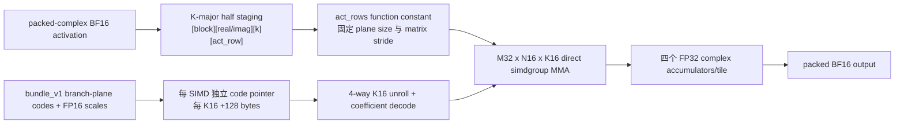

# Fairy2i W1 Metal pp512 性能边界 ABBA 实验报告

日期：2026-07-18（Asia/Shanghai）

分支：`codex/metal`

模型：`/Users/a1806/llama/qwen_1bit_scale/qwen3-fairy2i-w1-bundle-v1-qkv.gguf`

硬件：Apple M4，Metal，统一内存

## 1. 最终结论

本轮已经在保持 GGUF `bundle_v1` 权重格式、FP32 complex MMA 累加顺序和生成结果不变的前提下，超过
`pp512 > 218 tok/s` 目标。

最终直接对比使用原始 staged prefill 实现 `e1734521` 作为 A，使用最终实现作为 B。测试顺序固定为
`A1 -> B1 -> B2 -> A2`；每条腿先以同一二进制 R1 预热，再等待至少 15 秒，随后测 R5。

| workload | 原始 A（10 samples） | 最终 B（10 samples） | B 相对 A | 结论 |
| --- | ---: | ---: | ---: | --- |
| pp512 | 203.8684 tok/s | **226.7049 tok/s** | **+11.2016%** | 达标，保留 |
| tg128 | 29.0663 tok/s | 29.0203 tok/s | -0.1583% | 性能中性，decode 无回退 |

最终保留的四项 prefill 优化是：

1. K-major activation staging + SIMD-local coefficient ownership，主 kernel 直接从 device activation 读取；
2. 用 Metal function constant 固定每个 prefill shape 的 `act_rows` 和矩阵 stride；
3. 把 bundle code 地址改为初始化一次、每个 K16 固定前进 128 bytes 的指针；
4. 强制展开一个 K64 中的四个 K16 子步。

这些优化只在 `is_bundle && is_w1 && act_rows % 16 == 0` 时启用。非 16 倍数 prefill 和单 token decode
继续走原路径。转换脚本、GGUF metadata、bundle code/scale 字节格式均未改变，不需要重新转换模型。

## 2. 为什么所有结论必须使用 ABBA

本机在不同时间会进入明显不同的 GPU 性能档位。同一个二进制的 pp512 绝对值曾在约 174、203、216、226
tok/s 之间变化；跨时刻直接相减会产生远大于真实代码差异的假增益。

本轮最终采用以下固定协议：

```text
A1 warm R1 -> 15 s -> A1 measure R5
B1 warm R1 -> 15 s -> B1 measure R5
B2 warm R1 -> 15 s -> B2 measure R5
A2 warm R1 -> 15 s -> A2 measure R5
```

- A、B 各有两条 R5 腿，最终分别合并为 10 samples；
- 所有调用共享 `/tmp/fairy2i-metal-bench-cooldown`，脚本用互斥锁拒绝并发 benchmark；
- 任意相邻调用至少间隔 15 秒；
- warm R1 不计入结果；
- 只有同一 ABBA 内的 A/B 差值有效，不横向比较不同实验行的绝对 tok/s；
- 若一条腿内部出现性能档位跳变，整组作废，不删除单个异常样本。

早期单边筛选中，“2-A coefficient schedule”曾得到 `207.536 tok/s`，而较早 baseline 只有
`169.851 tok/s`，表面上像 `+22%`。在双方都重新预热的 ABBA 中，该候选实际为
`174.1080 -> 173.5583 tok/s`，即 `-0.3157%`。因此 `207.536` 只记录为环境状态变化，不能作为代码收益。

还作废过一组 tg function-constant guard：A2 的五个样本从 `24.3069, 24.3832` 逐步跳到
`25.5789, 28.6741, 29.0867`。完整重跑后四腿均稳定在约 29 tok/s，真实差值为 `-0.0547%`。

## 3. 最终数据流与线程分组



主 kernel 的固定分组为：

| 项目 | 配置 |
| --- | --- |
| threadgroup | 128 threads，4 个 simdgroup |
| output tile | M32 × N16 |
| 每个 simdgroup | 独占 8 个 output rows，计算两个 N8 tile |
| K substep | K16，由两个 K8 simdgroup matrix load 组成 |
| 一个 bundle block | K64，完整展开为 4 个 K16 substep |
| accumulator | `c_r0/c_i0/c_r1/c_i1`，FP32，原顺序不变 |
| coefficient scratch | 四个 M32 × K16 FP16 plane；每个 SIMD 使用互不重叠的 8-row 区域 |
| activation | 从 K-major device buffer 直接做 `simdgroup_load`，stride 为 function constant |

### 3.1 K-major activation

原 staging 输出按 activation row 连续：

```text
[act_row][block][real/imag][k]
```

最终 direct kernel 使用：

```text
[block][real/imag][k][act_row]
```

对应索引为：

```text
plane_size  = 64 * act_rows
block_base  = block * 2 * plane_size
index       = block_base + plane * plane_size + k * act_rows + act_row
```

因此一个 SIMD 读取固定 K 的连续 16 个 activation rows 时，可以直接用矩阵 load。每个 SIMD 仍会读取同一份
activation tile，但 M4 L1 能有效复用；实测这比把 activation 复制到 threadgroup、执行全 threadgroup barrier
更快。

### 3.2 SIMD-local coefficient ownership

每个 SIMD 独占 8 行 coefficient scratch：

```text
simd_lane  = thread_index & 31
coeff_row  = simdgroup_index * 8 + (simd_lane >> 2)
q4_local   = simd_lane & 3
```

一个 lane 负责一个 `(row, q4)`，展开四个连续 K phase。四个 SIMD 的写入区域互不重叠，所以 coefficient
同步从全 threadgroup barrier 缩小到 `simdgroup_barrier(mem_threadgroup)`，同时完全移除 activation
threadgroup staging。

### 3.3 `act_rows` function constant

`FC_FAIRY2I_BUNDLE_W1_PREFILL + 0` 保存当前 prefill 的 `act_rows`。C++ pipeline cache key包含
`actrows=<N>`，K-major staging 与 direct MMA kernel 都用同一个常量。

这让编译器把以下运行时量变成常量：

- activation plane size：`64 * act_rows`；
- K-major index 的行 stride；
- 四次 activation `simdgroup_load` 的 matrix stride；
- 每个 K8/K16 子步的 activation 基址偏移。

代价是每个首次出现的 16 倍数 prefill shape 需要创建一组 pipeline。pipeline 创建发生在正式 workload
计时前，进程内会缓存；常见的 512-token ubatch 只生成一组。非 16 倍数 shape 不生成特化 pipeline。

### 3.4 bundle code 指针归纳

原实现每个 K16 都重新计算：

```text
code_base = ((((physical_tile * 64 + slot) * 2) * 16) + row_lane)
```

bundle_v1 中一个 slot 占 `2 branches * 16 rows = 32 bytes`。K16 前进四个 q4 slot，因此地址增量恒定为
`4 * 32 = 128 bytes`。最终实现只在每个 K64 block 开头计算一次 `code_ptr`，之后每个 K16 执行
`code_ptr += 128`。

### 3.5 K64 内 K16 展开

K64 恰好由四个 K16 组成。`FOR_UNROLL` 让编译器完全展开这四步，消除 loop branch，并使 code pointer、
activation offset 和 coefficient offset 都成为固定增量。内层 `ik=0/1` 强制展开只带来 `+0.0537%`，没有
继续保留；编译器已经能有效处理该二次循环。

## 4. 全部有效 pp512 ABBA

表中 A/B 绝对值只能在同一行比较。不同实验行处于不同硬件性能档位。

| B 候选（相对该行 A） | A tok/s | B tok/s | delta | 处置 |
| --- | ---: | ---: | ---: | --- |
| 2-A：两组 coefficient matrix 串行复用 | 174.1080 | 173.5583 | -0.3157% | 拒绝 |
| 移除 2-A matrix-load barrier | 171.8397 | 168.1163 | -2.1668% | 拒绝 |
| K-major + SIMD-local direct activation | 174.7220 | 176.5701 | **+1.0577%** | 保留 |
| 16×16 threadgroup transpose staging | 176.5344 | 176.4500 | -0.0478% | 拒绝 |
| coefficient/output scratch alias（8 KiB→4 KiB） | 176.7180 | 175.1180 | -0.9054% | 拒绝 |
| `act_rows` function constant | 176.3720 | 183.5016 | **+4.0424%** | 保留 |
| K16 code pointer `+128` | 216.3387 | 221.3948 | **+2.3371%** | 保留 |
| K64 的四个 K16 强制展开 | 221.4080 | 226.6236 | **+2.3557%** | 保留 |
| 四个 scale 改为一次 `half4` load | 226.5411 | 226.5114 | -0.0131% | 拒绝 |
| `ik=0/1` 强制展开 | 226.6215 | 226.7433 | +0.0537% | 噪声，拒绝 |
| **原始 staged → 最终实现** | **203.8684** | **226.7049** | **+11.2016%** | **最终结论** |

拒绝的候选均已从工作树删除；仓库不保留 runtime 实验枚举或无效 kernel。git history 中保留候选/回退提交，
用于审计实验过程。

## 5. retained 候选的 tg128 ABBA guard

被 pp512 淘汰的候选只改动 `act_rows != 1` 的 prefill kernel，未继续消耗一组 tg 测试。每个被保留的阶段以及
最终累计版本都做了 tg128 ABBA。

| B 候选（相对该行 A） | A tok/s | B tok/s | delta | 结论 |
| --- | ---: | ---: | ---: | --- |
| direct activation | 24.3854 | 24.3406 | -0.1839% | 中性 |
| `act_rows` function constant（有效重跑） | 29.0604 | 29.0445 | -0.0547% | 中性 |
| code pointer | 29.0192 | 29.0693 | +0.1724% | 中性 |
| K16×4 unroll | 29.0753 | 29.0993 | +0.0824% | 中性 |
| **原始 → 最终** | **29.0663** | **29.0203** | **-0.1583%** | **中性，无 decode 回退** |

## 6. 最终 ABBA 原始样本

### 6.1 pp512

| leg | mean tok/s | five samples |
| --- | ---: | --- |
| A1 original | 203.7620 | 203.821, 203.735, 203.647, 203.663, 203.944 |
| B1 final | 226.6806 | 226.773, 226.798, 226.778, 226.747, 226.307 |
| B2 final | 226.7292 | 226.772, 226.652, 226.671, 226.763, 226.788 |
| A2 original | 203.9748 | 203.986, 203.625, 204.094, 204.053, 204.116 |

合并：A `203.8684`，B `226.7049`，`+11.201589%`。

原始目录：

```text
/tmp/fairy2i-w1-pp-boundary/abba-warmed-original-vs-final-pp-20260718/
```

### 6.2 tg128

| leg | mean tok/s | five samples |
| --- | ---: | --- |
| A1 original | 29.0295 | 29.0268, 29.0927, 28.8576, 29.0028, 29.1675 |
| B1 final | 29.0777 | 28.9926, 29.1400, 28.9228, 29.1742, 29.1589 |
| B2 final | 28.9629 | 28.9874, 29.0932, 28.7812, 28.7908, 29.1620 |
| A2 original | 29.1032 | 28.9466, 29.0821, 29.1578, 29.1592, 29.1701 |

合并：A `29.0663`，B `29.0203`，`-0.158293%`。

原始目录：

```text
/tmp/fairy2i-w1-pp-boundary/abba-warmed-original-vs-final-tg-20260718/
```

## 7. 正确性和代码质量

| 检查 | 结果 |
| --- | --- |
| Release Metal build：`test-fairy2i test-fairy2i-loader llama-bench llama-cli` | PASS |
| `ctest -R fairy2i` | 2/2 PASS |
| Metal bundle W1 N=16 direct path vs scalar reference，容差 `1e-2` | PASS |
| N=17 fallback path | PASS |
| W1/W2 variant matrix | 各 336 cases PASS |
| 原始 vs 最终 deterministic 32-token generation | stdout bit-exact |
| `git clang-format --diff`（相关 C/C++ 文件） | clean |
| touched-source clang-tidy | exit 0；仅既有 whole-file/header warnings |
| `git diff --check` | clean |

确定性输出 SHA256：

```text
f2635713105d527554d9dd308962eab2c8b728395d27decb59fe346124dc496e
```

原始和最终输出：

```text
/tmp/fairy2i-w1-pp-boundary/final-correctness-20260718/original.stdout
/tmp/fairy2i-w1-pp-boundary/final-correctness-20260718/final.stdout
```

## 8. 其它 ABBA artifact

```text
/tmp/fairy2i-w1-pp-boundary/abba-warmed-original-vs-winner-pp/
/tmp/fairy2i-w1-pp-boundary/abba-warmed-winner-vs-no-barrier/
/tmp/fairy2i-w1-pp-boundary/abba-warmed-original-vs-direct-act-pp-20260718/
/tmp/fairy2i-w1-pp-boundary/abba-warmed-original-vs-direct-act-tg-20260718/
/tmp/fairy2i-w1-pp-boundary/abba-warmed-direct-act-vs-tiled-stage-pp-20260718/
/tmp/fairy2i-w1-pp-boundary/abba-warmed-direct-act-vs-scratch-alias-pp-20260718/
/tmp/fairy2i-w1-pp-boundary/abba-warmed-direct-act-vs-actrows-fc-pp-20260718/
/tmp/fairy2i-w1-pp-boundary/abba-warmed-direct-act-vs-actrows-fc-tg-rerun-20260718/
/tmp/fairy2i-w1-pp-boundary/abba-warmed-actrows-fc-vs-code-pointer-pp-20260718/
/tmp/fairy2i-w1-pp-boundary/abba-warmed-actrows-fc-vs-code-pointer-tg-20260718/
/tmp/fairy2i-w1-pp-boundary/abba-warmed-code-pointer-vs-k16-unroll-pp-20260718/
/tmp/fairy2i-w1-pp-boundary/abba-warmed-code-pointer-vs-k16-unroll-tg-20260718/
/tmp/fairy2i-w1-pp-boundary/abba-warmed-k16-unroll-vs-vector-scale-pp-20260718/
/tmp/fairy2i-w1-pp-boundary/abba-warmed-k16-unroll-vs-ik-unroll-pp-20260718/
```

## 9. 外部机器复测命令

单独测最终 pp512：

```bash
/Users/a1806/.codex/worktrees/0a47/llama.cpp/build-rel-metal/bin/llama-bench \
  --model /Users/a1806/llama/qwen_1bit_scale/qwen3-fairy2i-w1-bundle-v1-qkv.gguf \
  --n-prompt 512 --n-gen 0 \
  --repetitions 5 --threads 8 \
  --batch-size 2048 --ubatch-size 512 \
  --n-gpu-layers 99 --flash-attn 1 --mmap 1
```

单独测最终 tg128：

```bash
/Users/a1806/.codex/worktrees/0a47/llama.cpp/build-rel-metal/bin/llama-bench \
  --model /Users/a1806/llama/qwen_1bit_scale/qwen3-fairy2i-w1-bundle-v1-qkv.gguf \
  --n-prompt 0 --n-gen 128 \
  --repetitions 5 --threads 8 \
  --batch-size 2048 --ubatch-size 512 \
  --n-gpu-layers 99 --flash-attn 1 --mmap 1
```

不要把 pp/tg 参数写成逗号列表；两个 workload 分开执行。

完整 ABBA 可使用现有 guard 脚本：

```bash
ROOT=/Users/a1806/.codex/worktrees/0a47/llama.cpp
MODEL=/Users/a1806/llama/qwen_1bit_scale/qwen3-fairy2i-w1-bundle-v1-qkv.gguf
A=/tmp/fairy2i-abba/original/build-rel-metal/bin/llama-bench
B=$ROOT/build-rel-metal/bin/llama-bench
RESULTS=/tmp/fairy2i-external-abba-pp

run_leg() {
  tag=$1
  binary=$2
  RESULTS_DIR=$RESULTS REPS=1 COOLDOWN_SECONDS=15 BINARY=$binary \
    $ROOT/perf/scripts/run_fairy2i_metal_bench.sh pp $MODEL warm-$tag
  RESULTS_DIR=$RESULTS REPS=5 COOLDOWN_SECONDS=15 BINARY=$binary \
    $ROOT/perf/scripts/run_fairy2i_metal_bench.sh pp $MODEL $tag
}

run_leg A1-original $A
run_leg B1-final $B
run_leg B2-final $B
run_leg A2-original $A
```

若 `/tmp/fairy2i-abba/original` 已被清理，可从 `e1734521` 重新创建 detached worktree 并以与最终版本相同的
Release/Metal/embed/shared-library 选项构建。

## 10. 仍可继续探索但未进入默认实现的方向

1. **3-MMA Gauss complex**：四次 real MMA 降到三次，是最大算术降幅，但改变 FP32 加法顺序和舍入，必须
   单独做 perplexity、generation 和任务质量评估，不能作为当前 bit-exact 默认路径。
2. **融合前一算子与 K-major staging**：可消除独立 staging dispatch 和中间 buffer，但需要 graph/structured
   op 改造，并处理 attention/FFN 多消费者，改动范围明显更大。
3. **预展开 coefficient packet**：转换时直接保存 MMA-ready FP16 coefficient tile，可删除运行时 code decode，
   但权重体积约扩大 8 倍，且旧 profiler 显示 pp 不是权重带宽主导。
4. **直接从 simdgroup accumulator 打包输出**：理论上可删除 4 KiB output scratch 和最终 barrier；当前 MSL
   接口没有在仓库中使用可移植的 matrix-element extraction。简单 scratch alias 已实测回退 `0.905%`。
5. **更多 function constant**：可固定 K blocks、output stride 或 bias 状态，但 K=2048/6144 的大循环若被完全
   展开，会造成 AIR 代码膨胀和寄存器压力；应先用编译器统计或新 trace 证明收益。
6. **scale SIMD broadcast**：四标量 load 改 `half4` 已是 `-0.013%`，说明编译器/L1 已处理；继续增加 shuffle
   或 threadgroup barrier 的胜率很低。

在保持 bit-exact、现有 bundle_v1 权重体积和 M32×N16×K16 数学结构的约束下，本轮 `226.7 tok/s` 可视为
当前实现的可靠局部边界。下一数量级提升更可能来自减少 complex MMA 数量或更大范围的 graph fusion，而不是
继续调整 bundle code/scale 的字节顺序。
